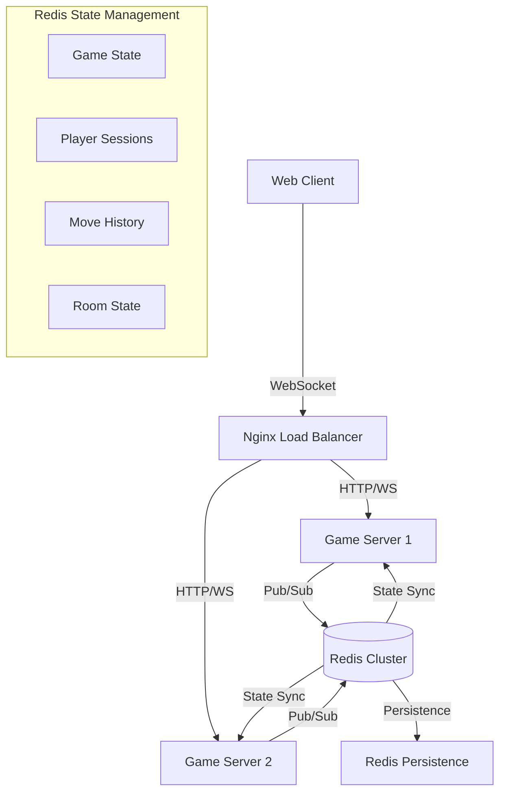

# CTORGame - Multiplayer Online Game

A multiplayer online version of the classic tic-tac-toe game, supporting real-time gameplay between two players.

## Project Overview

CTORGame transforms the original hotseat tic-tac-toe implementation into a full-fledged online multiplayer game using client-server architecture. Players can create game rooms, share room codes with opponents, and play in real-time over the internet.

## Documentation

Detailed documentation can be found in the [docs](./docs) directory:
- [Development Guide](./docs/development.md) - Setup, configuration and development tips
- [API Documentation](./docs/api.md) - API endpoints and WebSocket events (TODO)
- [Deployment Guide](./docs/deployment.md) - Production deployment instructions (TODO)
- [Testing Guide](./docs/testing.md) - Testing strategy and examples (TODO)

## User Stories

### As a Player, I want to:
- Create a new game room and receive a unique room code
- Join an existing game using a room code
- See the game board update in real-time when my opponent makes a move
- Know when it's my turn to play
- See the game status (win/lose/draw)
- Be notified if my opponent disconnects
- Resume any interrupted game at any time using the game code
- Share game results via unique link without registration
- Access game history and replays anonymously using game codes
- Start a new game after completion

### Game Persistence Requirements:
- Games should be automatically saved after each move
- Interrupted games must be resumable using the original game code
- No authentication required, all games are anonymous
- Game state and history must be preserved across server restarts
- Each game should have a shareable results page with final board state

### As a Developer, I want to:
- Have clear separation between client and server code
- Use type-safe communication between client and server
- Handle edge cases (disconnections, invalid moves, etc.)
- Scale the application for multiple concurrent games

## Architecture

### Technology Stack
- **Frontend**: 
  - React + TypeScript + Vite
  - Tailwind CSS for styling
  - Socket.IO client for real-time communication
  - React Query for state management

- **Backend**: 
  - Node.js + Express + TypeScript
  - Socket.IO for real-time game events
  - Redis for state management and persistence
  - Distributed state synchronization

- **DevOps**:
  - Docker + Docker Compose for containerization
  - Nginx for reverse proxy and static file serving
  - GitHub Actions for CI/CD:
    - Automated testing on every commit
    - Docker image builds after merge
    - GHCR container registry integration
    - Slack notifications
    - Security scanning with Snyk

### Infrastructure



#### Redis Data Structures

```typescript
// Game State (Key: game:{gameId}:state)
{
    board: number[][];       // Current board state
    currentPlayer: number;   // Active player (0 or 1)
    currentTurn: {
        placeOperationsLeft: number;
        moves: GameMove[];
    };
    score: {
        player1: number;
        player2: number;
    };
    gameOver: boolean;
    winner: number | null;
    lastUpdate: number;     // Timestamp
}

// Game Room (Key: game:{gameId}:room)
{
    players: Array<{
        id: string;         // Socket ID
        number: number;     // Player number
    }>;
    status: 'waiting' | 'playing' | 'finished';
    lastUpdate: number;     // Timestamp
}

// Player Session (Key: player:{socketId}:session)
{
    gameId: string;        // Current game ID
    playerNumber: number;  // Player's number
    lastActivity: number;  // Timestamp
}

// Move History (Key: game:{gameId}:moves)
List<{
    type: 'PLACE' | 'REPLACE';
    x: number;
    y: number;
    playerNumber: number;
    timestamp: number;
}>

// PubSub Channels
game:{gameId}:events -> Channel for game events
player:events -> Channel for player events
system:events -> Channel for system events

// Sets
games:active -> Set of active game IDs
games:finished -> Set of finished game IDs

// TTL Settings
- Game State: 1 hour
- Player Session: 2 hours
- Game Room: 1 hour
- Move History: 24 hours
```

### Project Structure
```
ctorgame/
├── client/                # Frontend application
│   ├── src/
│   │   ├── components/    # React components
│   │   ├── hooks/        # Custom React hooks
│   │   └── types/        # TypeScript types
├── server/                # Backend application
│   ├── src/
│   │   ├── websocket/    # WebSocket handlers
│   │   └── types/        # Server-side types
└── shared/                # Shared types and utilities
    └── types/            # Common TypeScript interfaces
```

## Client-Server Communication

### WebSocket Events

#### Client to Server
- `createGame`: Request to create a new game room
- `joinGame`: Request to join an existing game room
- `makeMove`: Send a move to the server
- `disconnect`: Handle player disconnection

#### Server to Client
- `gameCreated`: New game room created with room code
- `gameStarted`: Both players joined, game can begin
- `gameStateUpdated`: Game state changed (after moves)
- `playerDisconnected`: Opponent left the game
- `error`: Error messages (invalid moves, etc.)

### Data Models

```typescript
interface GameState {
  board: (number | null)[][];  // Game board state
  gameOver: boolean;           // Is game finished
  winner: number | null;       // Winner's player number (0/1/null)
}

interface Move {
  row: number;    // Row index
  col: number;    // Column index
}

interface Player {
  id: string;     // Socket ID
  number: number; // Player number (0/1)
}
```

## Game Flow

1. Player 1 creates a game room
   - Server generates unique room code
   - Returns code to Player 1

2. Player 2 joins with room code
   - Server validates room exists
   - Adds Player 2 to room
   - Notifies both players game can start

3. Gameplay
   - Server maintains game state
   - Validates all moves
   - Broadcasts updates to both players
   - Checks for win/draw conditions

4. Game End
   - Server notifies both players of result
   - Players can start new game

## Development Setup

### Environment Configuration

Before starting the development environment, you need to set up environment variables:

1. Copy `.env.example` to `.env` for production environment:
   ```bash
   cp .env.example .env
   ```

2. Copy `.env.dev.example` to `.env.dev` for development environment:
   ```bash
   cp .env.dev.example .env.dev
   ```

These files contain necessary configuration for both the client and server components. Review and adjust the values according to your environment.

### Using Docker (recommended for production-like environment)

1. Install Docker and Docker Compose
2. Start all services:
   ```bash
   docker-compose -f docker-compose.dev.yml up
   ```

### Local Development (without Docker)

1. Install pnpm (if not installed):
   ```bash
   npm install -g pnpm
   ```

2. Install dependencies in root, client and server directories:
   ```bash
   # Root dependencies
   pnpm install

   # Server dependencies
   cd server && pnpm install
   cd ..

   # Client dependencies
   cd client && pnpm install
   cd ..
   ```

3. Start development servers:
   ```bash
   # In one terminal - start the client
   cd client && pnpm dev

   # In another terminal - start the server
   cd server && pnpm dev
   ```

4. Build for production:
   ```bash
   # Build client
   cd client && pnpm build

   # Build server
   cd server && pnpm build
   ```

The client will be available at http://localhost:5173 and the server at http://localhost:3000.

## Production Deployment

### Docker Compose Setup

The application uses Docker Compose for easy deployment with separate services:

```yaml
# docker-compose.yml
version: '3.8'

services:
  nginx:
    image: nginx:alpine
    ports:
      - "80:80"
    volumes:
      - ./nginx.conf:/etc/nginx/nginx.conf:ro
    depends_on:
      - client
      - server

  client:
    build:
      context: .
      dockerfile: ./client/Dockerfile
    environment:
      - VITE_API_URL=http://server:3000
    volumes:
      - ./client:/app
      - /app/node_modules
    depends_on:
      - server

  server:
    build:
      context: .
      dockerfile: ./server/Dockerfile
    environment:
      - NODE_ENV=production
      - PORT=3000
      - REDIS_URL=redis://redis:6379
      - REDIS_PREFIX=ctorgame:prod:
      - REDIS_PASSWORD=secure_password
    volumes:
      - ./server:/app
      - /app/node_modules
    depends_on:
      - redis

  redis:
    image: redis:7-alpine
    ports:
      - "6379:6379"
    volumes:
      - redis_data:/data

volumes:
  redis_data:
```

### Redis Configuration

The project uses Redis in cluster mode for scalability and reliability:

```yaml
redis:
  image: redis:7-alpine
  command: redis-server --appendonly yes --requirepass ${REDIS_PASSWORD}
  environment:
    - REDIS_PASSWORD=secure_password
  volumes:
    - redis_data:/data
  ports:
    - "6379:6379"
  healthcheck:
    test: ["CMD", "redis-cli", "ping"]
    interval: 5s
    timeout: 3s
    retries: 5
```

Key Redis features used:
- AOF persistence for data durability
- Key space notifications for real-time events
- Pub/Sub for game events distribution
- Hash sets for game state storage
- Lists for move history
- Sets for active games tracking

### Development Setup

For local development with hot reload:

```bash
# Start all services in development mode
docker-compose -f docker-compose.dev.yml up

# Start specific service
docker-compose -f docker-compose.dev.yml up client
docker-compose -f docker-compose.dev.yml up server
```

### Production Deployment

For production deployment:

```bash
# Build and start all services
docker-compose up --build -d

# View logs
docker-compose logs -f

# Scale game servers
docker-compose up -d --scale server=3
```

### Service URLs and Monitoring

#### Service Endpoints
- Client Application: http://localhost
- API/WebSocket: ws://localhost/socket.io
- Redis Commander: http://localhost:8081 (development only)

#### Monitoring Endpoints
- Health Check: http://localhost:3000/health
- WebSocket Status: http://localhost:3000/ws/status
- Redis Metrics: http://localhost:9121/metrics
- Application Metrics: http://localhost:3000/metrics

#### Development Tools
- Redis Commander for data inspection
- Prometheus for metrics collection
- Grafana for visualization (optional)

#### Health Checks
The application includes comprehensive health checks:
```typescript
interface HealthStatus {
    status: 'healthy' | 'degraded' | 'unhealthy';
    redis: {
        connected: boolean;
        latency: number;  // in ms
        usedMemory: number;
        commandsProcessed: number;
    };
    websocket: {
        connections: number;
        rooms: number;
        events: {
            received: number;
            sent: number;
            errors: number;
        };
    };
    uptime: number;
    lastCheck: string;
}

## State Management

### Distributed State Architecture

The game uses Redis as the primary state store with the following key features:

1. **State Synchronization**
   - All game state is stored in Redis
   - Multiple game servers share the same state
   - Atomic operations using Redis locks
   - Real-time updates via Pub/Sub

2. **Data Persistence**
   - AOF (Append-Only File) persistence
   - Regular RDB snapshots
   - Configurable backup frequency
   - Automatic recovery

3. **Event Distribution**
   ```mermaid
   sequenceDiagram
       participant Client
       participant Server1
       participant Redis
       participant Server2
       
       Client->>Server1: Make Move
       Server1->>Redis: Lock Game State
       Server1->>Redis: Update State
       Redis-->>Server1: Confirm Update
       Redis-)Server2: Publish State Change
       Server2->>Client: Update Game State
   ```

4. **State Recovery**
   - Automatic session recovery
   - Game state restoration
   - Player reconnection handling
   - Timeout management

5. **Scalability Features**
   - Horizontal scaling of game servers
   - Load distribution across nodes
   - Connection persistence
   - State replication

6. **Monitoring and Debugging**
   - Real-time state tracking
   - Performance metrics
   - Error logging
   - Health checks

## Testing

The project includes comprehensive testing infrastructure:

### Running Tests
```bash
# Unit Tests
pnpm test           # Run all unit tests
pnpm test:watch    # Run in watch mode
pnpm test:coverage # Run with coverage

# Integration Tests
pnpm test:integration

# E2E Tests
pnpm test:e2e      # Run in headless mode
pnpm test:e2e:open # Open Cypress UI

# Performance Tests
pnpm test:perf     # Run k6 load tests
```

### Test Structure
- Unit Tests: `src/**/__tests__/*.test.tsx`
- Integration Tests: `tests/integration/`
- E2E Tests: `tests/e2e/`
- Performance Tests: `tests/perf/`

### Coverage Requirements
- Unit Tests: 80% coverage
- Integration Tests: Critical paths
- E2E Tests: Main user flows
- Performance: Response < 200ms

For detailed information about testing, see [Testing Guide](docs/testing.md)

## Contributing

1. Fork the repository
2. Create feature branch
3. Commit changes
4. Push to branch
5. Create Pull Request

## Game History and Replay Feature

The game includes a comprehensive replay system that allows players to:
- View a list of completed games
- Watch full game replays with VCR-like controls
- Navigate through individual moves
- Analyze game progression and strategies

### Replay Controls
- Play/Pause: Control replay playback
- Next/Previous: Navigate between moves
- Speed Control: Adjust replay speed (0.5x, 1x, 2x)
- Jump to Move: Select specific moves from the timeline

### Game History Features
- View game details (date, players, result)
- Access replay for any completed game
- See move-by-move progression
- Analyze board states at any point

## Future Improvements

- Add user authentication
- Add spectator mode for live games
- Support custom board sizes
- Add chat functionality
- Add player rankings
- Implement tournament mode

## License

This project is licensed under the MIT License - see the LICENSE file for details.
