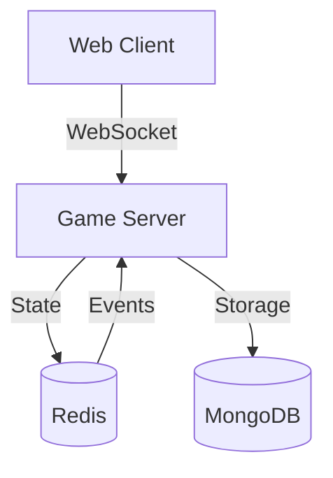

# CTORGame - Multiplayer Online Game

A real-time multiplayer game implemented with TypeScript, WebSocket, and distributed state management.

## Project Status

Current version: v0.1.0-stable

The project is undergoing active development with focus on:
- Type system improvements
- Error handling enhancements
- Connection management reliability

For detailed status and roadmap, see:
- [Type System Documentation](docs/TYPE_SYSTEM.md) - Type system overview
- [Type System Updates](docs/TYPE_SYSTEM_UPDATES.md) - Latest changes and migration status
- [Current Status](docs/CURRENT_STATUS.md) - Overall project status
- [Project Roadmap](ROADMAP.md) - Future development plans

## Key Features

- Real-time multiplayer gameplay
- Distributed state management
- Automatic game state persistence
- Session recovery after disconnection
- Type-safe client-server communication
- Container-based deployment

## Quick Start

### Development Setup

1. Clone the repository:
```bash
git clone https://github.com/vcb88/ctorgame.git
cd ctorgame
```

2. Configure environment:
```bash
cp .env.dev.example .env.dev
```

3. Start development environment:
```bash
docker-compose -f docker-compose.dev.yml up
```

For detailed setup instructions, see [Environment Configuration](docs/ENVIRONMENT_CONFIG.md).

### Production Deployment

1. Configure environment:
```bash
cp .env.example .env
# Edit .env with production values
```

2. Deploy with Docker:
```bash
docker-compose up -d
```

For deployment details, see [Deployment Guide](docs/deployment.md).

## Architecture

The project uses a distributed architecture with:
- React + TypeScript frontend
- Node.js + Express backend
- Redis for state management
- MongoDB for persistence
- WebSocket for real-time communication

For detailed architecture documentation, see:
- [Database Structures](docs/DATABASE_STRUCTURES.md)
- [WebSocket API V2](docs/WEBSOCKET_API_V2.md)
- [Environment Configuration](docs/ENVIRONMENT_CONFIG.md)

### Key Components



## Development Process

### Type System Notes

The project currently maintains shared types in three locations:
1. `/shared` - Source of truth
2. `/client/src/shared.ts` - Client copy
3. `/server/src/shared.ts` - Server copy

This is a temporary solution during the MVP phase. All changes to shared types must be synchronized across these files.

### Documentation Structure

- `docs/` - Technical documentation
  - `DATABASE_STRUCTURES.md` - Data structures and schemas
  - `WEBSOCKET_API_V2.md` - WebSocket API documentation
  - `ENVIRONMENT_CONFIG.md` - Environment setup guide
  - `CURRENT_STATUS.md` - Current development status
  - Other technical docs

### Development Guidelines

- Use TypeScript for all new code
- Follow the existing project structure
- Update documentation with code changes
- Add tests for new features
- Keep changes focused and atomic

For complete development guidelines, see [Contributing Guide](CONTRIBUTING.md).

## Project Structure

```
ctorgame/
├── client/          # Frontend application
├── server/          # Backend application
├── shared/          # Shared types and utilities
├── docs/           # Documentation
└── docker/         # Docker configurations
```

## Core Technologies

- **Frontend**: React, TypeScript, Socket.IO Client
- **Backend**: Node.js, Express, TypeScript
- **State Management**: Redis
- **Database**: MongoDB
- **Infrastructure**: Docker, Nginx

## Contributing

See [Contributing Guide](CONTRIBUTING.md) for detailed instructions.

## License

This project is licensed under the MIT License - see [LICENSE](LICENSE) file for details.

## Documentation

- [Database Structures](docs/DATABASE_STRUCTURES.md)
- [WebSocket API V2](docs/WEBSOCKET_API_V2.md)
- [Environment Config](docs/ENVIRONMENT_CONFIG.md)
- [Current Status](docs/CURRENT_STATUS.md)
- [Project Roadmap](ROADMAP.md)
- [Contributing Guide](CONTRIBUTING.md)

Last updated: January 14, 2025