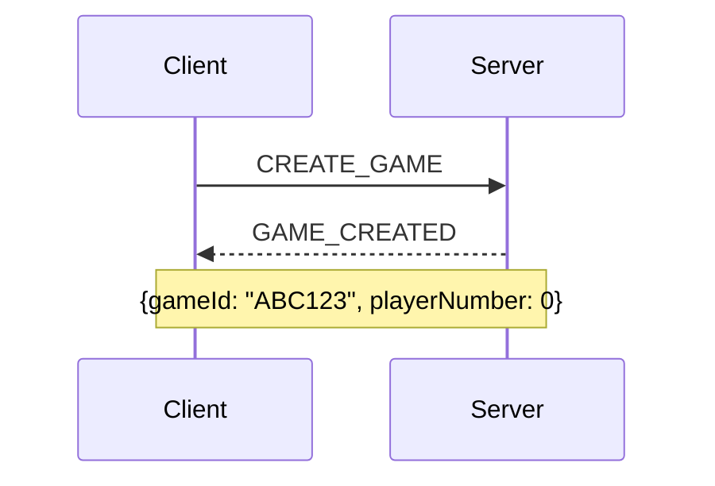
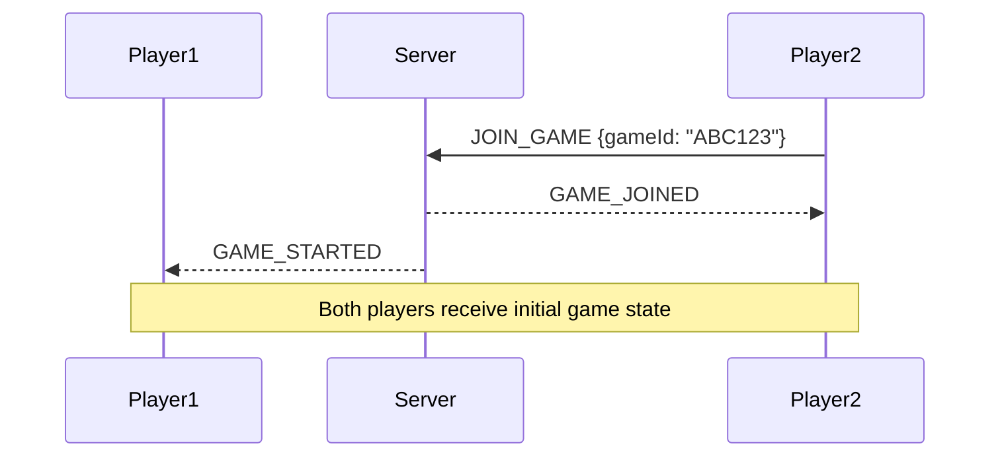
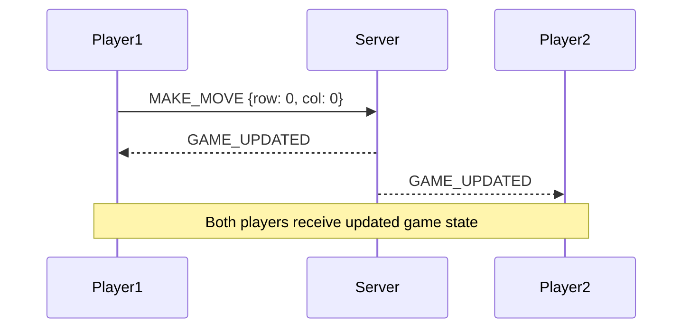

# WebSocket API Documentation

## Overview

This document describes the WebSocket events and protocols used in the CTORGame application.

## Connection Setup

### Client Connection
```typescript
import { io } from 'socket.io-client';

const socket = io('ws://server-url', {
  transports: ['websocket'],
  autoConnect: true,
  reconnection: true,
  reconnectionDelay: 1000,
  reconnectionDelayMax: 5000,
});
```

### Connection Events
```typescript
socket.on('connect', () => {
  console.log('Connected to server');
});

socket.on('disconnect', () => {
  console.log('Disconnected from server');
});

socket.on('error', (error) => {
  console.error('Socket error:', error);
});
```

## Game Events

### Event Types
```typescript
export enum WebSocketEvents {
  // Client -> Server
  CREATE_GAME = 'createGame',
  JOIN_GAME = 'joinGame',
  MAKE_MOVE = 'makeMove',
  LEAVE_GAME = 'leaveGame',
  RECONNECT = 'reconnect',

  // Server -> Client
  GAME_CREATED = 'gameCreated',
  GAME_JOINED = 'gameJoined',
  GAME_STARTED = 'gameStarted',
  GAME_UPDATED = 'gameStateUpdated',
  GAME_OVER = 'gameOver',
  PLAYER_DISCONNECTED = 'playerDisconnected',
  ERROR = 'error'
}
```

### Event Payloads

#### Create Game
```typescript
// Client -> Server
socket.emit(WebSocketEvents.CREATE_GAME);

// Server -> Client
interface GameCreatedPayload {
  gameId: string;
  playerNumber: number; // 0 or 1
}
```

#### Join Game
```typescript
// Client -> Server
interface JoinGamePayload {
  gameId: string;
}

// Server -> Client
interface GameJoinedPayload {
  gameId: string;
  playerNumber: number;
  gameState: GameState;
}
```

#### Make Move
```typescript
// Client -> Server
interface MakeMovePayload {
  gameId: string;
  move: {
    row: number;
    col: number;
  };
}

// Server -> Client
interface GameUpdatedPayload {
  gameState: GameState;
  lastMove: {
    player: number;
    row: number;
    col: number;
  };
}
```

## State Types

### Game State
```typescript
interface GameState {
  board: (number | null)[][];
  currentPlayer: number;
  gameOver: boolean;
  winner: number | null;
  lastMove?: {
    player: number;
    row: number;
    col: number;
  };
}
```

### Player State
```typescript
interface PlayerState {
  id: string;
  number: number;
  connected: boolean;
}
```

## Error Handling

### Error Types
```typescript
enum GameError {
  INVALID_MOVE = 'INVALID_MOVE',
  GAME_NOT_FOUND = 'GAME_NOT_FOUND',
  GAME_FULL = 'GAME_FULL',
  NOT_YOUR_TURN = 'NOT_YOUR_TURN',
  GAME_OVER = 'GAME_OVER'
}

interface ErrorPayload {
  code: GameError;
  message: string;
  details?: any;
}
```

### Error Events
```typescript
socket.on(WebSocketEvents.ERROR, (error: ErrorPayload) => {
  switch (error.code) {
    case GameError.INVALID_MOVE:
      // Handle invalid move
      break;
    case GameError.GAME_NOT_FOUND:
      // Handle game not found
      break;
    // ... handle other errors
  }
});
```

## Example Flows

### Game Creation Flow


### Game Join Flow


### Gameplay Flow


## Testing WebSocket Events

### Socket Mock Setup
```typescript
// test-utils.ts
export const createMockSocket = () => {
  const mockSocket = {
    emit: vi.fn(),
    on: vi.fn(),
    off: vi.fn(),
    close: vi.fn()
  };

  return {
    socket: mockSocket,
    emit: mockSocket.emit,
    lastEmittedEvent: () => {
      const calls = mockSocket.emit.mock.calls;
      return calls[calls.length - 1];
    }
  };
};
```

### Event Testing Examples
```typescript
describe('WebSocket Events', () => {
  const mockSocket = createMockSocket();

  it('handles game creation', () => {
    render(<Game socket={mockSocket.socket} />);
    
    // Simulate server response
    const gameCreatedCallback = mockSocket.on.mock.calls
      .find(call => call[0] === WebSocketEvents.GAME_CREATED)?.[1];
      
    act(() => {
      gameCreatedCallback?.({
        gameId: 'TEST123',
        playerNumber: 0
      });
    });

    expect(screen.getByText('Game Code: TEST123')).toBeInTheDocument();
  });

  it('handles moves', () => {
    render(<Game socket={mockSocket.socket} />);
    
    // Make move
    fireEvent.click(screen.getByTestId('cell-0-0'));
    
    expect(mockSocket.emit).toHaveBeenCalledWith(
      WebSocketEvents.MAKE_MOVE,
      expect.objectContaining({
        row: 0,
        col: 0
      })
    );
  });
});
```

## Connection Management

### Reconnection Logic
```typescript
// Client implementation
const setupSocketReconnection = (socket: Socket) => {
  socket.on('disconnect', () => {
    // Handle disconnect UI
  });

  socket.on('reconnect', () => {
    // Re-join game if was in one
    const gameId = localStorage.getItem('currentGame');
    if (gameId) {
      socket.emit(WebSocketEvents.RECONNECT, { gameId });
    }
  });
};
```

### Connection Testing
```typescript
describe('Connection Management', () => {
  it('handles disconnection', () => {
    const { socket } = createMockSocket();
    render(<Game socket={socket} />);

    // Simulate disconnect
    act(() => {
      socket.emit('disconnect');
    });

    expect(screen.getByText('Disconnected')).toBeInTheDocument();
  });

  it('handles reconnection', () => {
    const { socket } = createMockSocket();
    render(<Game socket={socket} />);

    // Simulate reconnect
    act(() => {
      socket.emit('reconnect');
    });

    expect(screen.getByText('Connected')).toBeInTheDocument();
  });
});
```

## Best Practices

### 1. Event Handling
- Always handle connection errors
- Implement reconnection logic
- Validate event payloads
- Handle all possible game states

### 2. Testing
- Mock socket for unit tests
- Test reconnection scenarios
- Verify event payloads
- Test error conditions

### 3. Performance
- Use binary data when appropriate
- Implement throttling for rapid events
- Monitor connection quality
- Handle connection timeouts