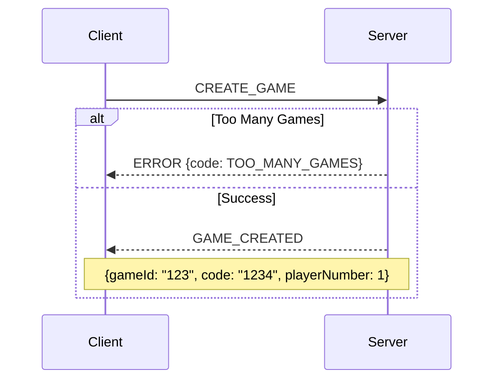
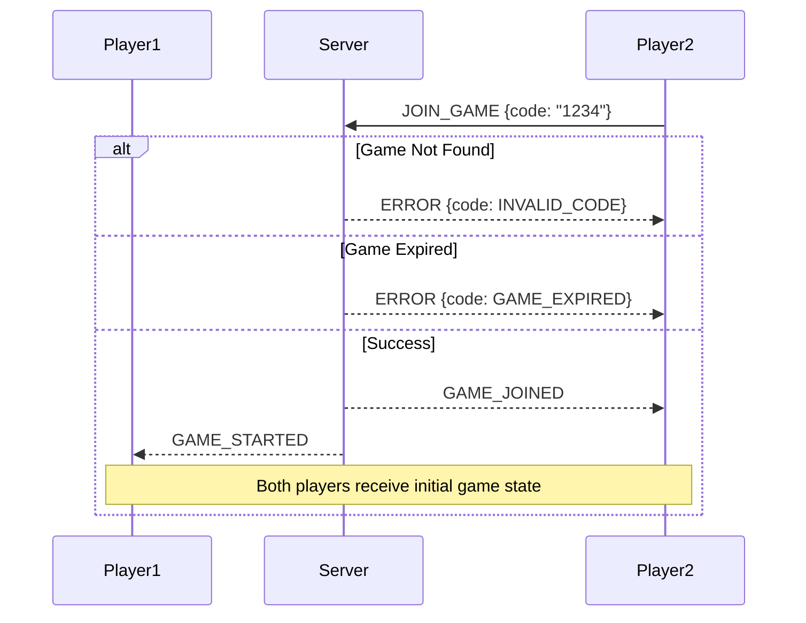

# WebSocket API Documentation (v2)

## Overview

This document describes the WebSocket events and protocols used in the CTORGame application.

## System Limitations
- Maximum concurrent games: 50
- Room lifetime: 30 minutes of inactivity
- Connection code format: 4 digits (0000-9999)

## Connection Setup

### Client Connection
```typescript
import { io } from 'socket.io-client';

const socket = io('ws://server-url', {
  transports: ['websocket'],
  autoConnect: true,
  reconnection: true,
  reconnectionDelay: 1000,
  reconnectionDelayMax: 5000,
});
```

## Game Events

### Event Types
```typescript
export enum WebSocketEvents {
  // Client -> Server
  CREATE_GAME = 'createGame',
  JOIN_GAME = 'joinGame',
  MAKE_MOVE = 'makeMove',
  LEAVE_GAME = 'leaveGame',
  RECONNECT = 'reconnect',

  // Server -> Client
  GAME_CREATED = 'gameCreated',
  GAME_JOINED = 'gameJoined',
  GAME_STARTED = 'gameStarted',
  GAME_UPDATED = 'gameStateUpdated',
  GAME_OVER = 'gameOver',
  PLAYER_DISCONNECTED = 'playerDisconnected',
  ERROR = 'error',
  GAME_EXPIRED = 'gameExpired'
}
```

### Event Payloads

#### Create Game
```typescript
// Client -> Server
socket.emit(WebSocketEvents.CREATE_GAME);

// Server -> Client
interface GameCreatedPayload {
  gameId: string;      // Internal game ID
  code: string;        // 4-digit connection code
  playerNumber: 1 | 2; // 1 for first player, 2 for second
  expiresAt: number;   // Timestamp when game expires
}
```

#### Join Game
```typescript
// Client -> Server
interface JoinGamePayload {
  code: string;        // 4-digit connection code
}

// Server -> Client
interface GameJoinedPayload {
  gameId: string;
  playerNumber: 1 | 2;
  gameState: GameState;
  expiresAt: number;   // Timestamp when game expires
}
```

#### Make Move
```typescript
// Client -> Server
interface MakeMovePayload {
  gameId: string;
  x: number;
  y: number;
  playerNumber: 1 | 2;
}

// Server -> Client
interface GameUpdatedPayload {
  gameState: GameState;
  lastMove: {
    playerNumber: 1 | 2;
    x: number;
    y: number;
    timestamp: number;
  };
  expiresAt: number;   // Updated expiration time
}
```

## Game State Types

### Game State
```typescript
interface GameState {
  board: number[][];   // Game board state
  currentPlayer: 1 | 2;
  opsRemaining: number;// Operations remaining in current turn
  status: GameStatus;
  lastMoveAt: number;  // Last activity timestamp
}

type GameStatus = 'waiting' | 'playing' | 'finished';
```

### Room State
```typescript
interface GameRoom {
  id: string;          // Internal game ID
  code: string;        // 4-digit connection code
  players: {
    first?: string;    // First player connection ID
    second?: string;   // Second player connection ID
  };
  state: GameState;
  createdAt: number;   // Room creation timestamp
  lastActivityAt: number; // Last activity timestamp
  expiresAt: number;   // Room expiration timestamp
}
```

## Error Handling

### Error Types
```typescript
enum GameError {
  INVALID_MOVE = 'INVALID_MOVE',
  GAME_NOT_FOUND = 'GAME_NOT_FOUND',
  GAME_FULL = 'GAME_FULL',
  NOT_YOUR_TURN = 'NOT_YOUR_TURN',
  GAME_OVER = 'GAME_OVER',
  INVALID_CODE = 'INVALID_CODE',
  GAME_EXPIRED = 'GAME_EXPIRED',
  TOO_MANY_GAMES = 'TOO_MANY_GAMES'
}

interface ErrorPayload {
  code: GameError;
  message: string;
  details?: any;
}
```

## Example Flows

### Game Creation Flow


### Game Join Flow with Code


### Game Expiration Flow
```mermaid
sequenceDiagram
    participant Player1
    participant Server
    participant Player2
    
    Note over Player1,Server,Player2: No activity for 30 minutes
    Server-->>Player1: GAME_EXPIRED
    Server-->>Player2: GAME_EXPIRED
    Note over Player1,Server,Player2: Players must create new game
```

## Connection Management

### Reconnection with Code
```typescript
// Client implementation
const reconnectToGame = (socket: Socket, code: string) => {
  socket.emit(WebSocketEvents.RECONNECT, { code });
};

socket.on('reconnect', () => {
  const savedCode = localStorage.getItem('gameCode');
  if (savedCode) {
    reconnectToGame(socket, savedCode);
  }
});
```

## Game History

### Move History
```typescript
interface GameMove {
  playerNumber: 1 | 2;
  x: number;
  y: number;
  timestamp: number;
}

interface GameHistory {
  gameId: string;
  code: string;
  players: {
    first: string;
    second: string;
  };
  moves: GameMove[];
  startedAt: number;
  finishedAt: number;
  winner?: 1 | 2;
  finalState: GameState;
}
```

## Best Practices

### 1. Security
- Validate all incoming payloads
- Check game existence and expiration before operations
- Verify player identity and turns
- Monitor for suspicious activity patterns

### 2. Performance
- Clean up expired games regularly
- Implement move rate limiting
- Use efficient board state representation
- Minimize payload sizes

### 3. User Experience
- Provide clear error messages
- Handle reconnection gracefully
- Show game expiration countdown
- Notify players of opponent disconnection