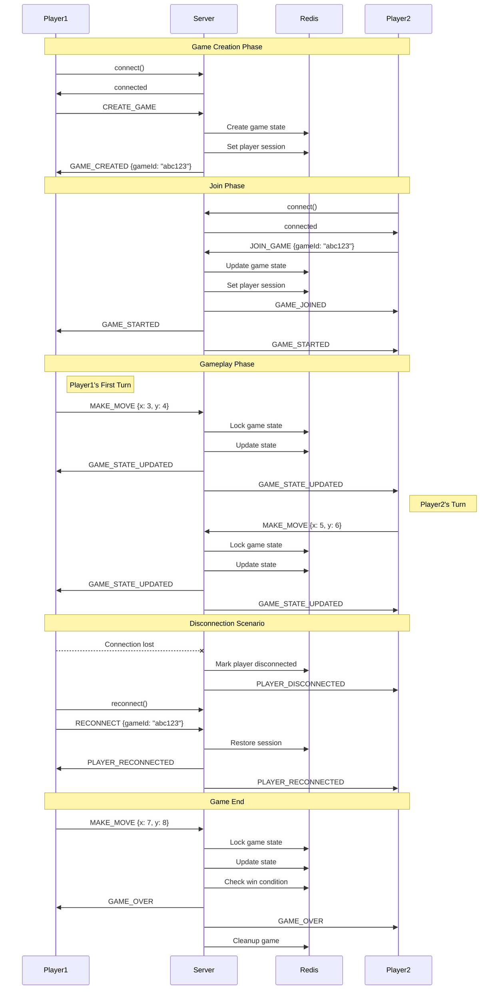
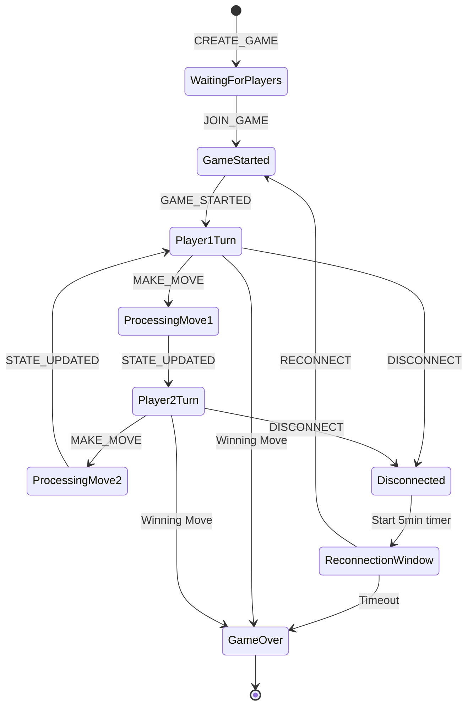
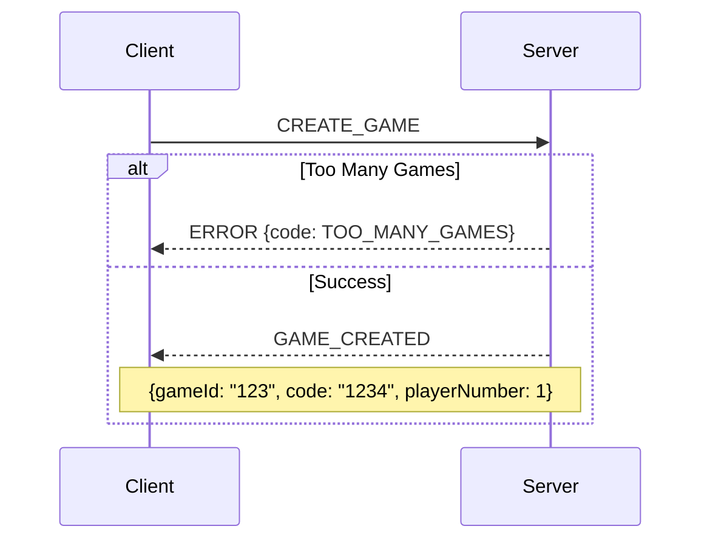
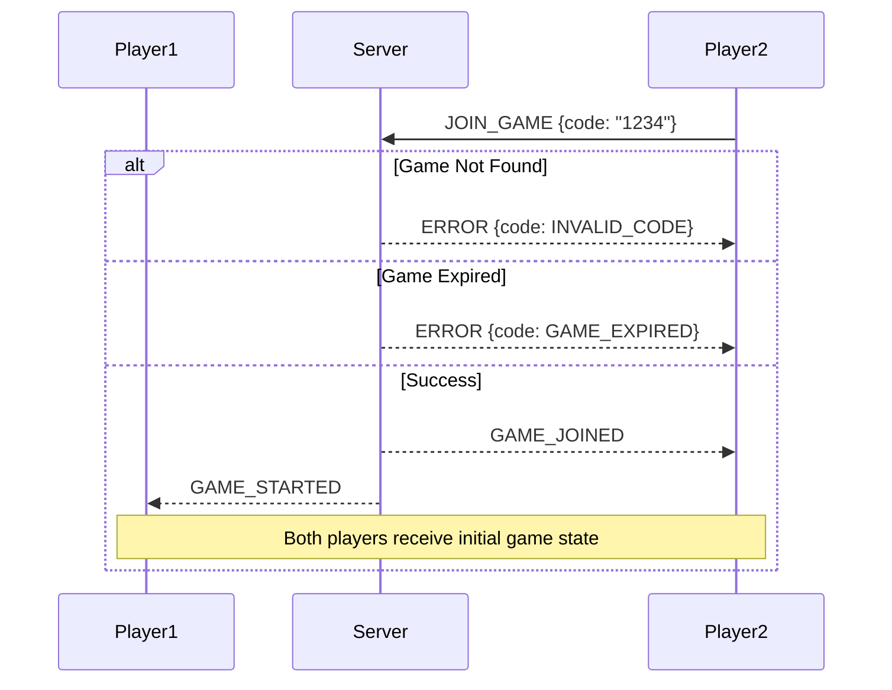
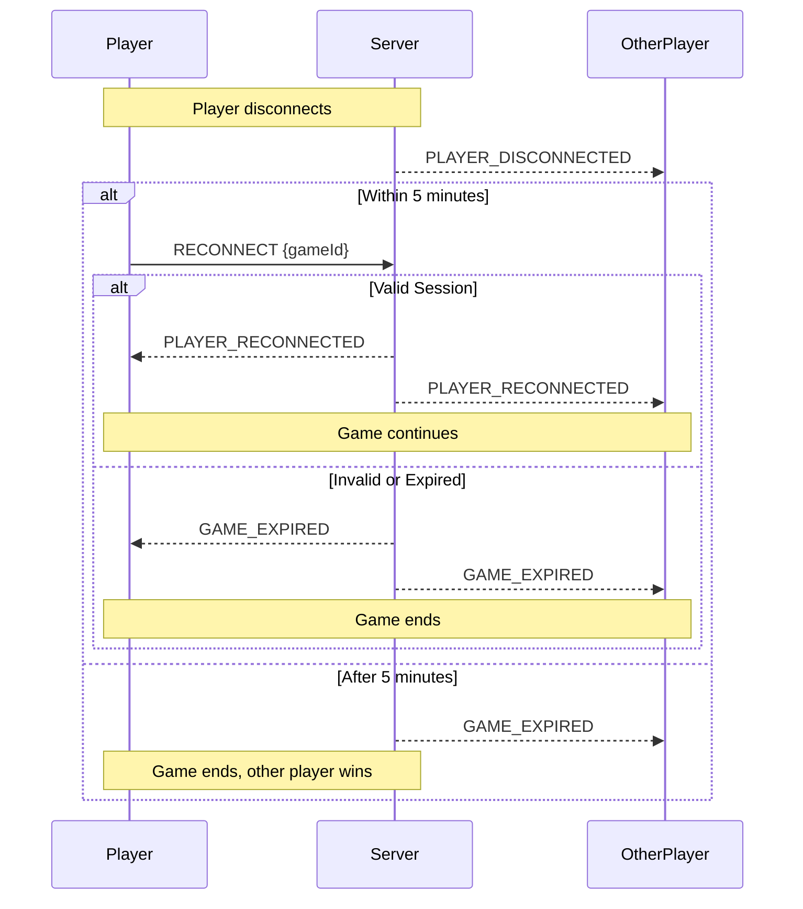

# WebSocket API Documentation (v2)

## Overview

This document describes the WebSocket events and protocols used in the CTORGame application.

## Complete Game Flow

Below is a detailed sequence of WebSocket events for a complete game session, from game creation to completion:



### Detailed Event Flow Description

1. **Game Creation**
   ```typescript
   // Player1 connects
   socket.connect()
   // Server responds with connection confirmation
   << 'connected'
   
   // Player1 creates game
   socket.emit('createGame')
   // Server responds with game details
   << {
       event: 'gameCreated',
       payload: {
           gameId: "abc123",
           playerNumber: 0
       }
   }
   ```

2. **Game Join**
   ```typescript
   // Player2 connects and joins
   socket.emit('joinGame', { gameId: "abc123" })
   // Server responds to Player2
   << {
       event: 'gameJoined',
       payload: {
           gameId: "abc123",
           playerNumber: 1
       }
   }
   
   // Both players receive game start notification
   << {
       event: 'gameStarted',
       payload: {
           gameState: {
               board: [[]], // 10x10 empty board
               currentPlayer: 0,
               currentTurn: {
                   placeOperationsLeft: 1, // First turn has 1 operation
                   moves: []
               },
               score: { player1: 0, player2: 0 }
           }
       }
   }
   ```

3. **Game Turns**
   ```typescript
   // Player1 makes first move
   socket.emit('makeMove', {
       gameId: "abc123",
       move: {
           type: "PLACE",
           x: 3,
           y: 4
       }
   })
   
   // Both players receive state update
   << {
       event: 'gameStateUpdated',
       payload: {
           gameState: {
               board: [[/* updated board */]],
               currentPlayer: 1, // Turn switches to Player2
               currentTurn: {
                   placeOperationsLeft: 2,
                   moves: []
               },
               score: { player1: 0, player2: 0 }
           }
       }
   }
   ```

4. **Disconnection Handling**
   ```typescript
   // Player1 disconnects unexpectedly
   >> 'disconnect'
   
   // Player2 receives notification
   << {
       event: 'playerDisconnected',
       payload: {
           player: 0
       }
   }
   
   // Player1 reconnects
   socket.emit('reconnect', { 
       gameId: "abc123"
   })
   
   // Both players receive reconnection notification
   << {
       event: 'playerReconnected',
       payload: {
           gameState: {/* current game state */},
           playerNumber: 0
       }
   }
   ```

5. **Game End**
   ```typescript
   // After winning move
   << {
       event: 'gameOver',
       payload: {
           gameState: {/* final game state */},
           winner: 0, // Player1 wins
           score: {
               player1: 55,
               player2: 45
           }
       }
   }
   ```

### State Transitions



### Event Timing Constraints

- Connection timeout: 10 seconds
- Move validation timeout: 5 seconds
- State update timeout: 5 seconds
- Reconnection window: 5 minutes
- Game expiration: 30 minutes of inactivity
- Lock timeout: 5 seconds

## System Architecture

### Components
- WebSocket Server: Handles real-time communication
- Redis: Manages distributed state and session data
- MongoDB: Stores persistent game data and history

### Game Identifiers Synchronization
- Each game has two identifiers:
  1. gameId: 6-character string (e.g., "BAZTKP") used as primary identifier in both Redis and MongoDB
  2. code: 4-digit number (e.g., "1234") for easier game joining
- Both identifiers are generated when creating a game
- Both Redis and MongoDB use the same gameId for consistency
- Players can join using either gameId or code
- MongoDB maintains unique indexes on both fields

### System Limitations
- Maximum concurrent games: 50
- Room lifetime: 30 minutes of inactivity
- Connection code format: random string (7 characters)
- Reconnection window: 5 minutes
- Operation lock timeout: 5 seconds

### State Management
- Game state is stored in Redis with TTL
- Player sessions are tracked with activity timestamps
- State operations are synchronized using Redis locks
- Automatic cleanup of expired games and sessions

## Connection Setup

### Client Connection
```typescript
import { io } from 'socket.io-client';

const socket = io('ws://server-url', {
  transports: ['websocket'],
  autoConnect: true,
  reconnection: true,
  reconnectionDelay: 1000,
  reconnectionDelayMax: 5000,
});
```

## Game Events

### Event Types
```typescript
export enum WebSocketEvents {
  // Client -> Server
  CREATE_GAME = 'createGame',
  JOIN_GAME = 'joinGame',
  MAKE_MOVE = 'makeMove',
  LEAVE_GAME = 'leaveGame',
  RECONNECT = 'reconnect',

  // Server -> Client
  GAME_CREATED = 'gameCreated',
  GAME_JOINED = 'gameJoined',
  GAME_STARTED = 'gameStarted',
  GAME_UPDATED = 'gameStateUpdated',
  GAME_OVER = 'gameOver',
  PLAYER_DISCONNECTED = 'playerDisconnected',
  ERROR = 'error',
  GAME_EXPIRED = 'gameExpired'
}
```

### Event Payloads

#### Create Game
```typescript
// Client -> Server
socket.emit(WebSocketEvents.CREATE_GAME);

// Server -> Client
interface GameCreatedPayload {
  gameId: string;      // 6-character game identifier (e.g., "BAZTKP")
  code: string;        // 4-digit connection code (e.g., "1234")
  playerNumber: 1 | 2; // 1 for first player, 2 for second
  expiresAt: number;   // Timestamp when game expires
}
```

#### Join Game
```typescript
// Client -> Server
interface JoinGamePayload {
  gameId: string;      // Either gameId or code can be used
  // or
  code: string;        // 4-digit connection code for easier joining
}

// Server -> Client
interface GameJoinedPayload {
  gameId: string;      // Same gameId used in both Redis and MongoDB
  playerNumber: 1 | 2;
  gameState: GameState;
  expiresAt: number;   // Timestamp when game expires
}
```

#### Make Move
```typescript
// Client -> Server
interface MakeMovePayload {
  gameId: string;
  x: number;
  y: number;
  playerNumber: 1 | 2;
}

// Server -> Client
interface GameUpdatedPayload {
  gameState: GameState;
  lastMove: {
    playerNumber: 1 | 2;
    x: number;
    y: number;
    timestamp: number;
  };
  expiresAt: number;   // Updated expiration time
}
```

## Game State Types

### Game State
```typescript
interface GameState {
  board: number[][];   // Game board state
  currentPlayer: 1 | 2;
  opsRemaining: number;// Operations remaining in current turn
  status: GameStatus;
  lastMoveAt: number;  // Last activity timestamp
}

type GameStatus = 'waiting' | 'playing' | 'finished';
```

### Room State
```typescript
interface GameRoom {
  id: string;          // Internal game ID
  code: string;        // 4-digit connection code
  players: {
    first?: string;    // First player connection ID
    second?: string;   // Second player connection ID
  };
  state: GameState;
  createdAt: number;   // Room creation timestamp
  lastActivityAt: number; // Last activity timestamp
  expiresAt: number;   // Room expiration timestamp
}
```

## Error Handling

### Error Types
```typescript
enum GameError {
  INVALID_MOVE = 'INVALID_MOVE',
  GAME_NOT_FOUND = 'GAME_NOT_FOUND',
  GAME_FULL = 'GAME_FULL',
  NOT_YOUR_TURN = 'NOT_YOUR_TURN',
  GAME_OVER = 'GAME_OVER',
  INVALID_CODE = 'INVALID_CODE',
  GAME_EXPIRED = 'GAME_EXPIRED',
  TOO_MANY_GAMES = 'TOO_MANY_GAMES'
}

interface ErrorPayload {
  code: GameError;
  message: string;
  details?: any;
}
```

## Example Flows

### Game Creation Flow


### Game Join Flow with Code


### Game Expiration Flow
```mermaid
sequenceDiagram
    participant Player1
    participant Server
    participant Player2
    
    Note over Player1,Server,Player2: No activity for 30 minutes
    Server-->>Player1: GAME_EXPIRED
    Server-->>Player2: GAME_EXPIRED
    Note over Player1,Server,Player2: Players must create new game
```

### Reconnection Flow


## Connection Management

### Connection Recovery
```typescript
/**
 * Connection recovery flow:
 * 1. Client detects disconnection
 * 2. Client attempts to reconnect using stored gameId
 * 3. Server validates reconnection request
 * 4. Server restores game state
 * 5. All players get updated state
 */

// Client implementation
interface ReconnectPayload {
  gameId: string;
}

// Store game information before disconnection
localStorage.setItem('gameData', JSON.stringify({
  gameId: currentGame.id,
  playerNumber: currentPlayer.number
}));

// Reconnection attempt
const reconnectToGame = (socket: Socket) => {
  const gameData = JSON.parse(localStorage.getItem('gameData'));
  if (gameData) {
    socket.emit(WebSocketEvents.Reconnect, { gameId: gameData.gameId });
  }
};

// Handle socket events
socket.on('connect', () => {
  reconnectToGame(socket);
});

socket.on(WebSocketEvents.PlayerReconnected, (data) => {
  // Update game state with received data
  updateGameState(data.gameState);
  setCurrentPlayer(data.currentPlayer);
});

socket.on(WebSocketEvents.GameExpired, ({ gameId, reason }) => {
  // Handle game expiration (timeout, disconnection, etc.)
  handleGameExpiration(reason);
  localStorage.removeItem('gameData');
});
```

#### Reconnection Timeouts
- Player reconnection window: 5 minutes
- Game session expiration: 30 minutes of inactivity

#### Reconnection States
```typescript
interface ReconnectionState {
  gameId: string;
  playerNumber: number;
  disconnectTime: number;
}

interface PlayerReconnectedPayload {
  gameState: GameState;
  currentPlayer: number;
  playerNumber: number;
}

interface GameExpiredPayload {
  gameId: string;
  reason: string;
}
```

## Game History

### Move History
```typescript
interface GameMove {
  playerNumber: 1 | 2;
  x: number;
  y: number;
  timestamp: number;
}

interface GameHistory {
  gameId: string;
  code: string;
  players: {
    first: string;
    second: string;
  };
  moves: GameMove[];
  startedAt: number;
  finishedAt: number;
  winner?: 1 | 2;
  finalState: GameState;
}
```

## Best Practices

### 1. Security
- Validate all incoming payloads
- Check game existence and expiration before operations
- Verify player identity and turns
- Monitor for suspicious activity patterns

### 2. Performance
- Clean up expired games regularly
- Implement move rate limiting
- Use efficient board state representation
- Minimize payload sizes

### 3. User Experience
- Provide clear error messages
- Handle reconnection gracefully
- Show game expiration countdown
- Notify players of opponent disconnection