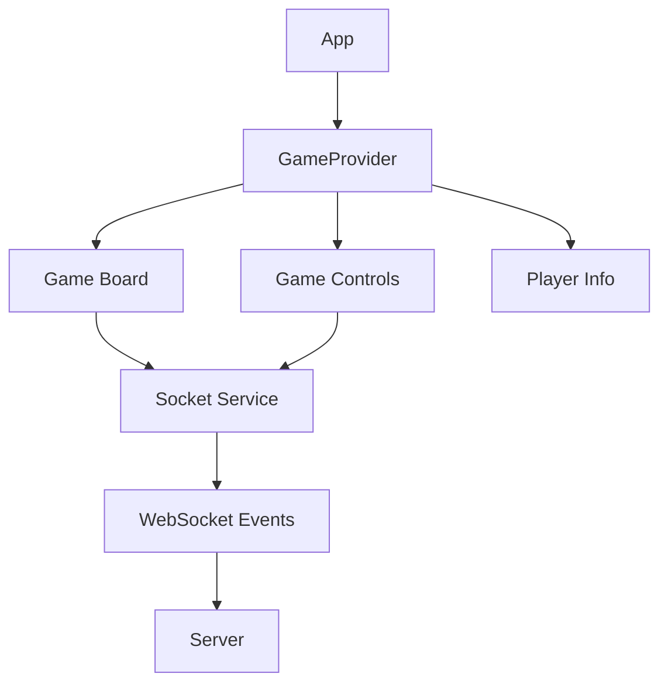
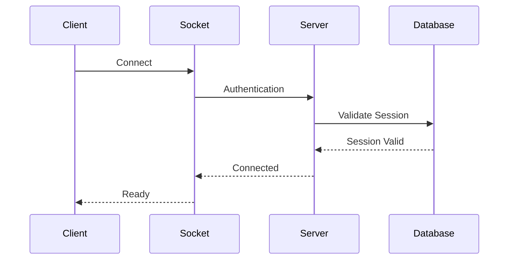
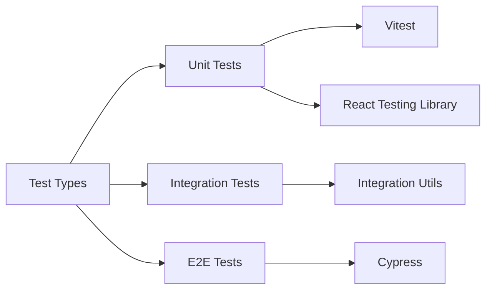
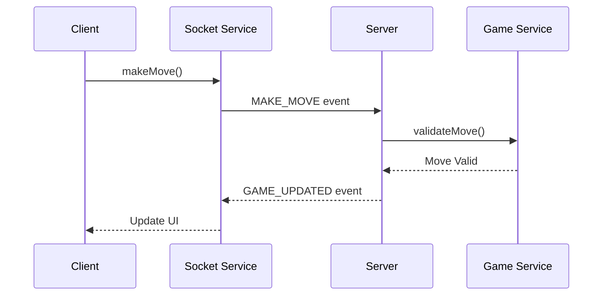
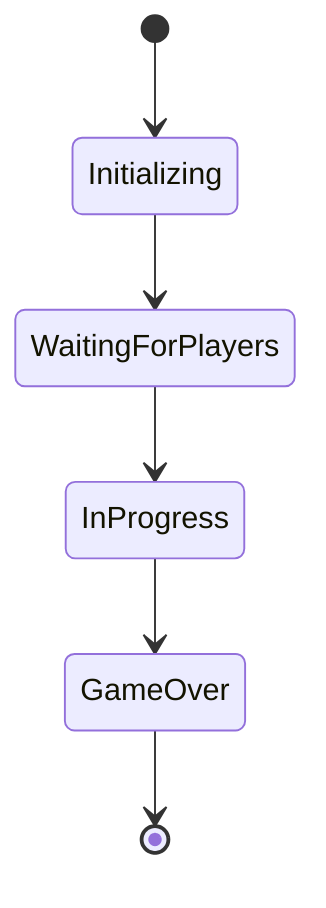
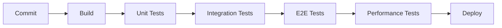

# CTORGame Architecture Documentation

## Project Architecture Overview

### Monorepo Structure
```
ctorgame/
├── client/               # Frontend React application
│   ├── src/
│   │   ├── components/  # React components
│   │   ├── hooks/      # Custom React hooks
│   │   ├── services/   # API and socket services
│   │   └── test/       # Test utilities
│   └── tests/          # Integration & E2E tests
├── server/              # Backend Node.js application
│   ├── src/
│   │   ├── controllers/
│   │   ├── services/
│   │   └── websocket/
│   └── tests/
└── shared/              # Shared types and utilities
    └── types/          # Common TypeScript interfaces
```

## Component Architecture

### Frontend Architecture



### Data Flow



## Testing Architecture

### Test Types and Tools



### Test Directory Structure
```
src/
├── components/
│   ├── ComponentName/
│   │   ├── index.tsx
│   │   ├── ComponentName.tsx
│   │   ├── ComponentName.test.tsx
│   │   └── ComponentName.styles.ts
│   └── ...
├── hooks/
│   ├── useHookName/
│   │   ├── index.ts
│   │   ├── useHookName.ts
│   │   └── useHookName.test.ts
│   └── ...
└── test/
    ├── setup.ts
    ├── test-utils.tsx
    └── mocks/
        ├── socket.ts
        └── server.ts
```

## Component Testing Strategy

### Unit Test Structure
```typescript
// Example component test structure
describe('ComponentName', () => {
  // Rendering tests
  describe('rendering', () => {
    it('renders default state');
    it('renders with props');
    it('renders loading state');
    it('renders error state');
  });

  // Interaction tests
  describe('interactions', () => {
    it('handles click events');
    it('handles form submission');
    it('handles keyboard events');
  });

  // State management tests
  describe('state management', () => {
    it('updates internal state');
    it('propagates state changes');
    it('handles side effects');
  });
});
```

### Integration Test Structure
```typescript
// Example integration test structure
describe('GameFlow', () => {
  describe('game creation', () => {
    it('creates new game');
    it('connects players');
    it('synchronizes game state');
  });

  describe('gameplay', () => {
    it('handles player moves');
    it('updates game state');
    it('determines winner');
  });
});
```

## Socket.IO Architecture

### Event Flow


### Socket Testing
```typescript
// Socket test setup
const mockSocket = createMockSocket({
  events: {
    'gameCreated': (data) => {},
    'gameUpdated': (data) => {},
    'error': (error) => {}
  }
});

// Test socket interactions
describe('Socket Integration', () => {
  it('emits events correctly', () => {
    // Test implementation
  });

  it('handles received events', () => {
    // Test implementation
  });
});
```

## Error Handling Strategy

### Error Boundaries
```typescript
// Error boundary component
class GameErrorBoundary extends React.Component {
  // Implementation
}

// Usage in tests
describe('ErrorBoundary', () => {
  it('catches rendering errors');
  it('shows fallback UI');
  it('logs errors');
});
```

### Socket Error Handling
```typescript
// Socket error handling
socket.on('error', (error) => {
  if (error.type === 'connection') {
    // Handle connection errors
  } else if (error.type === 'game') {
    // Handle game-specific errors
  }
});

// Testing error scenarios
describe('Socket Error Handling', () => {
  it('handles connection errors');
  it('handles game errors');
  it('shows appropriate error messages');
});
```

## State Management

### Game State Flow


### Testing State Changes
```typescript
describe('Game State Management', () => {
  it('initializes game state', () => {
    const { result } = renderHook(() => useGameState());
    expect(result.current.status).toBe('initializing');
  });

  it('transitions through game states', () => {
    // Test state transitions
  });
});
```

## Performance Considerations

### Performance Testing Strategy
```typescript
// Performance test setup
import { bench } from 'vitest';

bench('Component rendering', () => {
  const { rerender } = render(<GameBoard />);
  // Measure rendering performance
});

// Load testing
describe('Load Tests', () => {
  it('handles multiple concurrent games');
  it('maintains performance under load');
});
```

### Test Coverage Goals

| Component Type | Coverage Target | Critical Paths |
|---------------|-----------------|----------------|
| UI Components | 80% | User Interactions |
| Game Logic    | 95% | Game Rules |
| Socket Logic  | 90% | Real-time Events |
| State Management | 85% | State Transitions |

## Deployment Strategy

### Testing in CI/CD Pipeline


### Environment Setup
```yaml
# Test environment configuration
test:
  environment:
    - NODE_ENV=test
    - VITE_API_URL=http://localhost:3000
    - VITE_WS_URL=ws://localhost:3000
  services:
    - redis
    - postgres
```

## Documentation Requirements

### Component Documentation
```typescript
/**
 * GameBoard Component
 * 
 * @component
 * @example
 * ```tsx
 * <GameBoard
 *   state={gameState}
 *   onMove={handleMove}
 * />
 * ```
 */
```

### Test Documentation
```typescript
/**
 * Tests GameBoard component functionality
 * 
 * @group unit
 * @requires React Testing Library
 */
describe('GameBoard', () => {
  // Test cases
});
```