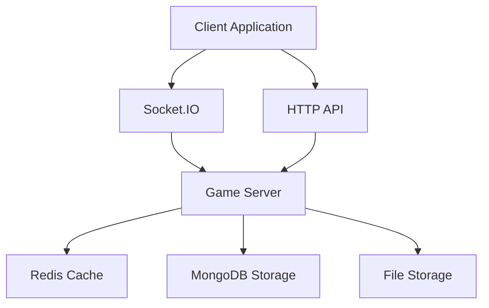
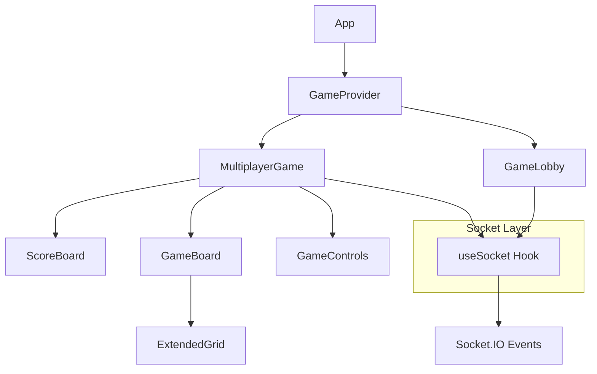
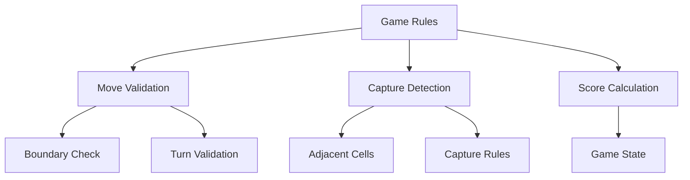
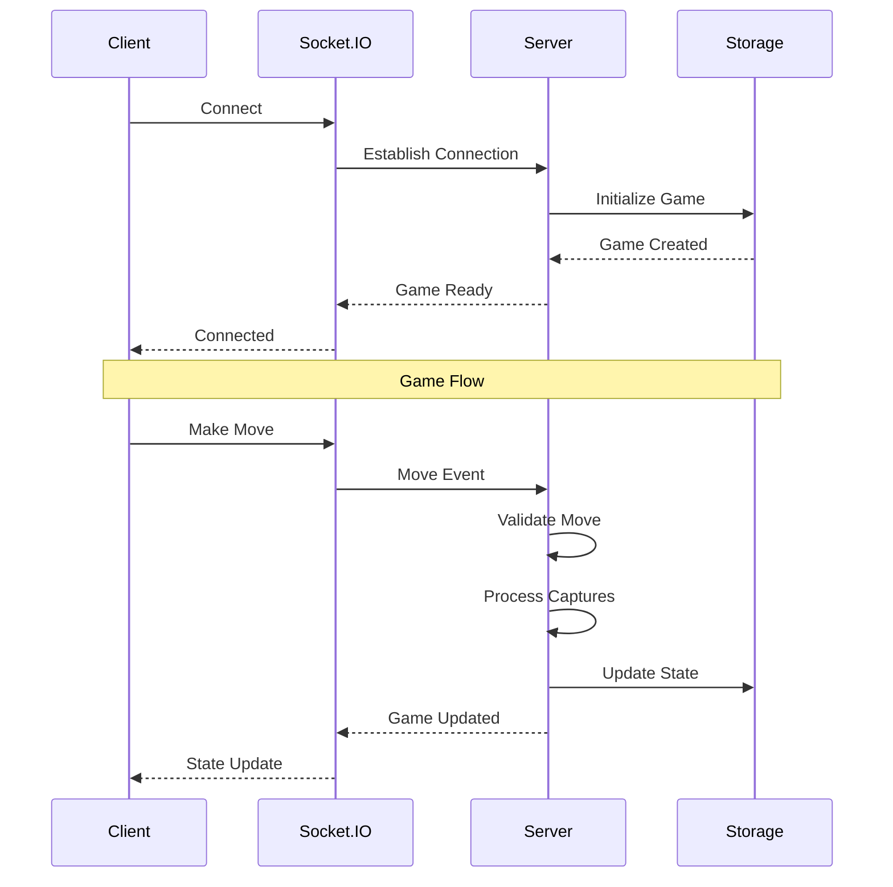
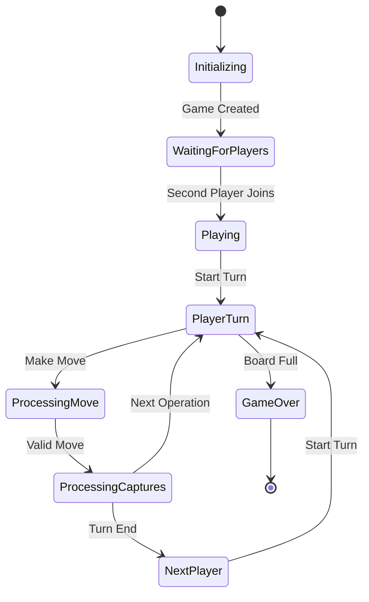
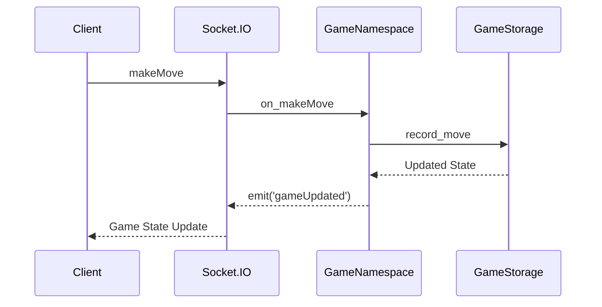
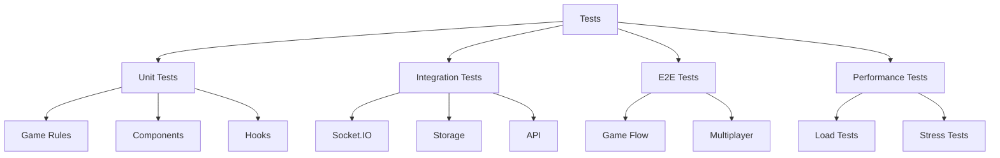
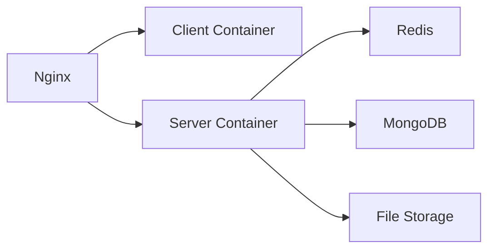

# CTORGame Architecture Documentation

## Project Architecture Overview

### System Architecture


### Monorepo Structure
```
ctorgame/
├── client/                # Frontend React application
│   ├── src/
│   │   ├── components/   # React components
│   │   ├── game/        # Game logic and rules
│   │   ├── hooks/       # Custom React hooks
│   │   ├── services/    # API and socket services
│   │   ├── styles/      # CSS styles
│   │   └── types/       # TypeScript definitions
│   └── tests/           # Integration & E2E tests
├── server/               # Backend Python application
│   ├── src/
│   │   ├── storage.py   # Game state storage
│   │   ├── socketio_server.py  # Socket.IO server
│   │   └── game/        # Game logic
│   └── tests/           # Server tests
├── shared/               # Shared types and utilities
├── docs/                 # Documentation
└── tests/               # End-to-end tests
```

## Component Architecture

### Frontend Architecture


### Game Logic Architecture


### Data Flow


## State Management

### Game State Structure
```typescript
interface GameState {
    board: Player[][];       // Current board state
    currentPlayer: Player;   // Active player
    status: GameStatus;      // Game status
    moves: GameMove[];       // Move history
    score: GameScore;        // Current scores
    winner: Player | null;   // Winner if game over
    opsRemaining: number;    // Operations left in turn
}
```

### State Flow


## Storage Architecture

### MongoDB Collections
- games: Game metadata and state
- metrics: Game statistics and analytics

### File Storage
- moves: Move history in compressed format
- game_states: Serialized game states
- metrics: Performance and analytics data

### Storage Classes
```python
class GameStorage:
    """Main storage interface"""
    def __init__(self):
        self.mongodb = AsyncIOMotorClient()
        self.file_storage = FileStorage()

    async def create_game(self) -> Dict:
        """Create new game"""
        
    async def record_move(self, game_id: str, move: Dict) -> None:
        """Record game move"""
        
    async def get_game_state(self, game_id: str) -> Dict:
        """Get current game state"""
```

## Socket.IO Architecture

### Namespace Structure
```python
class GameNamespace(socketio.AsyncNamespace):
    async def on_connect(self, sid, environ):
        """Handle client connection"""
        
    async def on_createGame(self, sid, data):
        """Handle game creation"""
        
    async def on_makeMove(self, sid, data):
        """Handle game moves"""
```

### Event Flow


## Testing Architecture

### Test Types


### Test Coverage Goals
| Component | Target | Critical Paths |
|-----------|--------|----------------|
| Game Logic | 95% | Captures, Scoring |
| Socket.IO | 90% | Real-time Events |
| Storage | 85% | Data Consistency |
| UI | 80% | User Interactions |

## Security Considerations

### WebSocket Security
- Connection validation
- Rate limiting
- Input validation
- Move validation
- State verification

### Data Security
- Game state integrity
- Move history integrity
- Score validation
- Player authentication

## Performance Optimization

### Caching Strategy
- Game state caching
- Move validation results
- Player session data
- Room membership

### Data Compression
- Move history compression
- Board state serialization
- Event payload optimization

## Deployment Architecture

### Docker Components


### Environment Configuration
```yaml
server:
  environment:
    - NODE_ENV=production
    - MONGODB_URL=mongodb://mongo:27017
    - REDIS_URL=redis://redis:6379
    - STORAGE_PATH=/data/games
  volumes:
    - game_data:/data/games
```

## Monitoring and Metrics

### Key Metrics
- Active games count
- Player connection status
- Move processing time
- Capture calculation time
- Storage operation latency
- WebSocket event latency

### Health Checks
- Database connectivity
- Redis availability
- Storage access
- Memory usage
- CPU utilization

## Documentation Structure

### Code Documentation
```typescript
/**
 * Process game move and calculate captures
 * @param state Current game state
 * @param move Player move
 * @returns Updated game state and captures
 */
function processMove(state: GameState, move: GameMove): MoveResult {
    // Implementation
}
```

### API Documentation
- WebSocket events
- REST endpoints
- Data structures
- Error codes
- Response formats