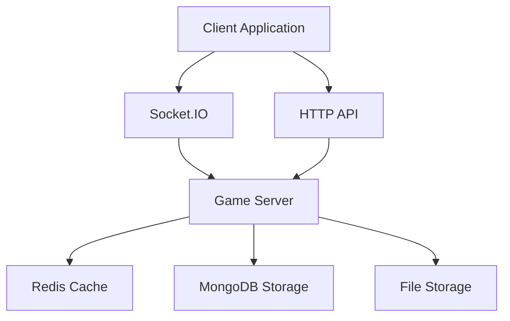
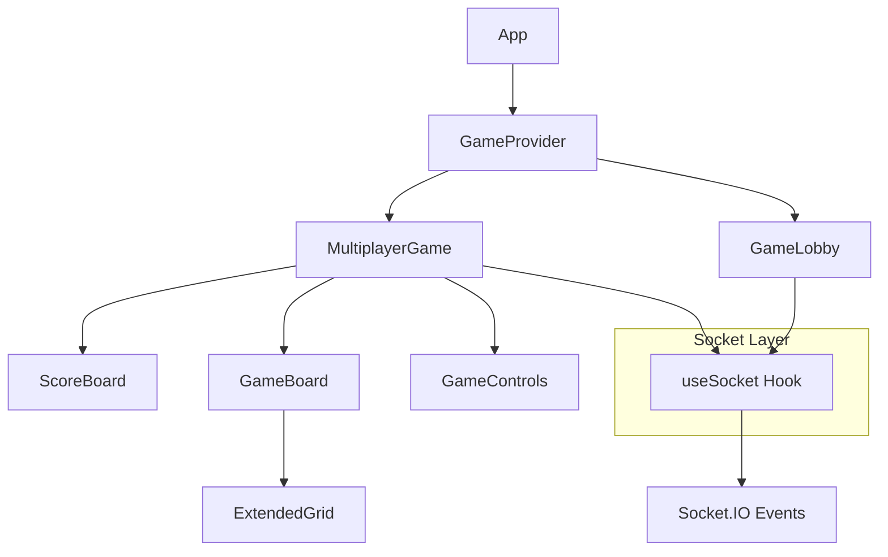
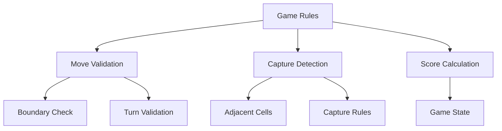
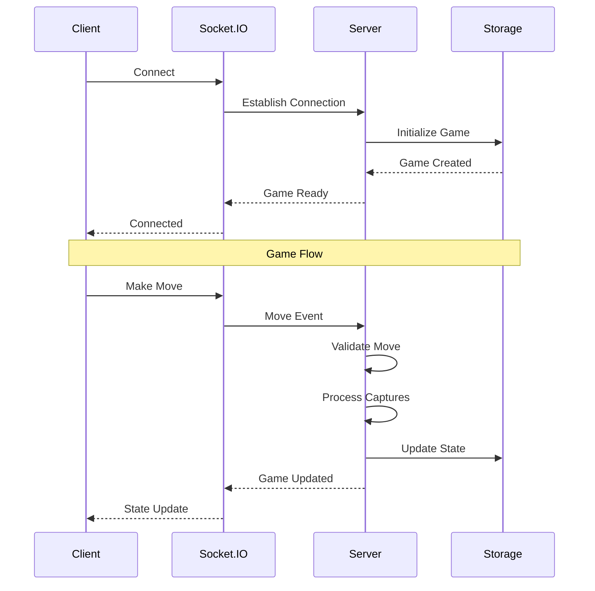
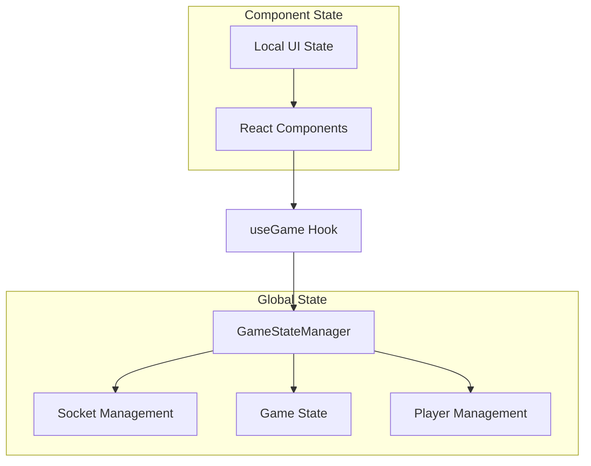
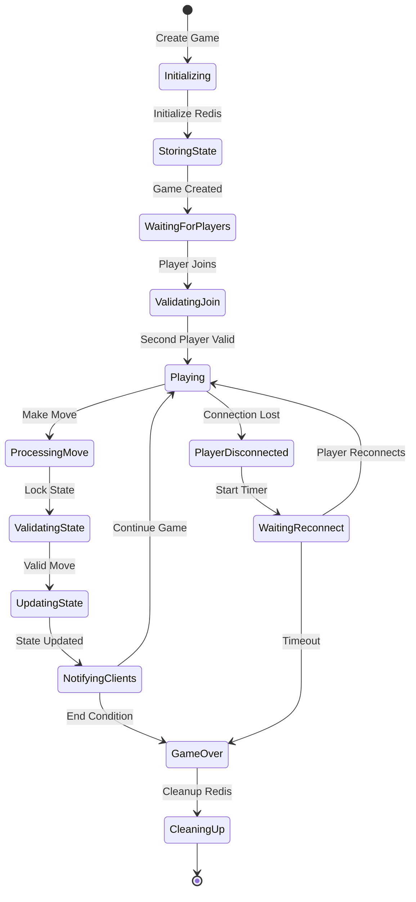
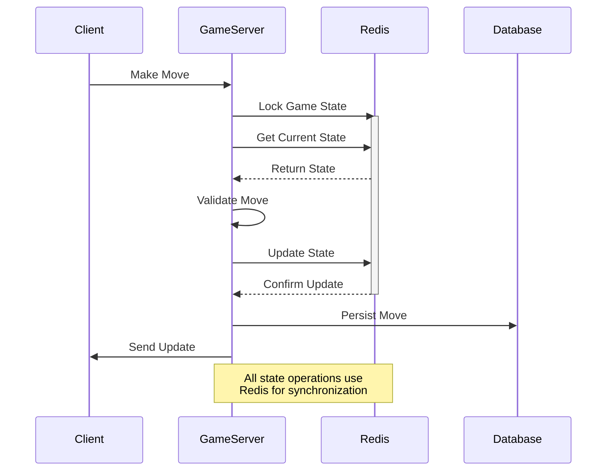
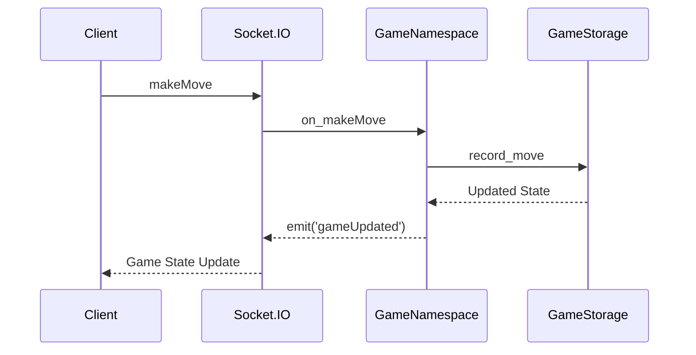
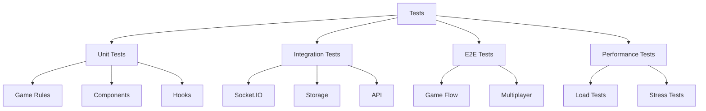
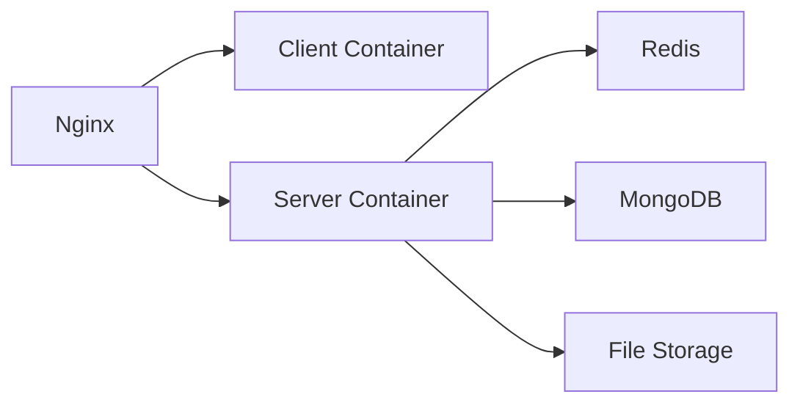

# CTORGame Architecture Documentation

## Project Architecture Overview

### System Architecture


### Monorepo Structure
```
ctorgame/
├── client/                # Frontend React application
│   ├── src/
│   │   ├── components/   # React components
│   │   ├── game/        # Game logic and rules
│   │   ├── hooks/       # Custom React hooks
│   │   ├── services/    # API and socket services
│   │   ├── styles/      # CSS styles
│   │   └── types/       # TypeScript definitions
│   └── tests/           # Integration & E2E tests
├── server/               # Backend TypeScript application
│   ├── src/
│   │   ├── config/     # Configuration
│   │   ├── services/   # Game and business logic
│   │   ├── entities/   # Database entities
│   │   ├── websocket/  # Socket.IO server
│   │   └── migrations/ # Database migrations
│   └── tests/          # Server tests
├── shared/               # Shared types and utilities
├── docs/                 # Documentation
└── tests/               # End-to-end tests
```

## Component Architecture

### Frontend Architecture


### Game Logic Architecture


### Data Flow


## State Management

### Planned Migration to Hybrid State Management

The project is transitioning to a hybrid state management approach that combines centralized game state management with component-local UI state. This new architecture is detailed in [STATE_MANAGEMENT_MIGRATION.md](./STATE_MANAGEMENT_MIGRATION.md).



Key aspects of the new architecture:
- Centralized game state management through GameStateManager
- Clear separation between game logic and UI concerns
- Improved state predictability and debugging
- Reduced component complexity
- Better socket connection handling

### Game State Management

#### Player Identification System
```typescript
/** Player identification in the game */
enum Player {
    None = 0,     // Empty cell or no player
    First = 1,    // First player
    Second = 2    // Second player
}

/**
 * Helper functions for player operations
 */
// Get the opponent player (First -> Second, Second -> First)
function getOpponent(player: Player): Player {
    if (player === Player.None) {
        throw new Error('Cannot get opponent for Player.None');
    }
    return player === Player.First ? Player.Second : Player.First;
}

// Game outcome constants for consistent result handling
const GameOutcome = {
    Draw: null as const,  // Represents a draw (no winner)
};

// Score tracking with type-safe indexing
interface GameScore {
    [Player.First]: number;  // First player's score
    [Player.Second]: number; // Second player's score
}
```

The Player enum system provides:
- Type-safe player identification across the application
- Clear distinction between empty cells (None) and players
- Consistent player naming (First/Second instead of numeric values)
- Helper functions for common operations
- Type-safe score indexing with enum keys
- Clear game outcome representation

#### Redis Data Structure
```typescript
// Game State (Key: game:{gameId}:state)
interface RedisGameState {
    board: Player[][];       // Current board state
    currentPlayer: Player;   // Active player
    status: GameStatus;      // Game status
    moves: GameMove[];       // Move history
    score: GameScore;        // Current scores
    winner: Player | null;   // Winner if game over
    opsRemaining: number;    // Operations left in turn
    lastUpdate: number;      // Last update timestamp
}

// Player Session (Key: player:{socketId}:session)
interface RedisPlayerSession {
    gameId: string;         // Current game ID
    playerNumber: Player;   // Player's enum value
    lastActivity: number;   // Last activity timestamp
}

// Game Room (Key: game:{gameId}:room)
interface RedisGameRoom {
    players: IPlayer[];     // Connected players
    status: GameStatus;     // Room status
    lastUpdate: number;     // Last update timestamp
}

// Game Events (Key: game:{gameId}:events)
interface RedisGameEvent {
    type: string;          // Event type
    data: any;            // Event data
    timestamp: number;    // Event timestamp
}
```

#### State Flow with Redis


#### Distributed State Synchronization


## Storage Architecture

### MongoDB Collections
- games: Game metadata and state
- metrics: Game statistics and analytics

### File Storage
- moves: Move history in compressed format
- game_states: Serialized game states
- metrics: Performance and analytics data

### Storage Service
```typescript
export class GameStorageService {
    constructor(
        private readonly mongoConnection: Connection,
        private readonly redisClient: Redis,
        private readonly fileStorage: FileStorage
    ) {}

    /**
     * Create a new game instance
     * @returns Created game data
     */
    async createGame(): Promise<GameData> {
        // Implementation
    }

    /**
     * Record a move in the game
     * @param gameId Game identifier
     * @param move Move data
     */
    async recordMove(gameId: string, move: GameMove): Promise<void> {
        // Implementation
    }

    /**
     * Retrieve current game state
     * @param gameId Game identifier
     * @returns Current game state
     */
    async getGameState(gameId: string): Promise<GameState> {
        // Implementation
    }
}
```

## Socket.IO Architecture

### Socket.IO Server
```typescript
export class GameServer {
    constructor(
        private io: Server,
        private gameService: GameService,
        private storageService: GameStorageService
    ) {
        this.setupEventHandlers();
    }

    private setupEventHandlers(): void {
        this.io.on('connection', (socket: Socket) => {
            // Handle connection
            this.handleConnection(socket);

            // Game events
            socket.on('createGame', (data, callback) => 
                this.handleCreateGame(socket, data, callback));
            
            socket.on('makeMove', (data, callback) => 
                this.handleMove(socket, data, callback));
            
            socket.on('disconnect', () => 
                this.handleDisconnect(socket));
        });
    }

    private async handleConnection(socket: Socket): Promise<void> {
        // Handle new connection
    }

    private async handleCreateGame(
        socket: Socket, 
        data: CreateGameDto, 
        callback: (response: GameResponse) => void
    ): Promise<void> {
        // Handle game creation
    }

    private async handleMove(
        socket: Socket,
        move: GameMoveDto,
        callback: (response: MoveResponse) => void
    ): Promise<void> {
        // Handle game move
    }
}
```

### Event Flow


## Testing Architecture

### Test Types


### Test Coverage Goals
| Component | Target | Critical Paths |
|-----------|--------|----------------|
| Game Logic | 95% | Captures, Scoring |
| Socket.IO | 90% | Real-time Events |
| Storage | 85% | Data Consistency |
| UI | 80% | User Interactions |

## Security Considerations

### WebSocket Security
- Connection validation
- Rate limiting
- Input validation
- Move validation
- State verification

### Data Security
- Game state integrity
- Move history integrity
- Score validation
- Player authentication

## Performance Optimization

### Caching Strategy
- Game state caching
- Move validation results
- Player session data
- Room membership

### Data Compression
- Move history compression
- Board state serialization
- Event payload optimization

## Deployment Architecture

### Docker Components


### Environment Configuration
```yaml
server:
  environment:
    - NODE_ENV=production
    - MONGODB_URL=mongodb://mongo:27017
    - REDIS_URL=redis://redis:6379
    - STORAGE_PATH=/data/games
  volumes:
    - game_data:/data/games
```

## Monitoring and Metrics

### Key Metrics
- Active games count
- Player connection status
- Move processing time
- Capture calculation time
- Storage operation latency
- WebSocket event latency

### Health Checks
- Database connectivity
- Redis availability
- Storage access
- Memory usage
- CPU utilization

## Documentation Structure

### Code Documentation
```typescript
/**
 * Process game move and calculate captures
 * @param state Current game state
 * @param move Player move
 * @returns Updated game state and captures
 */
function processMove(state: GameState, move: GameMove): MoveResult {
    // Implementation
}
```

### API Documentation
- WebSocket events
- REST endpoints
- Data structures
- Error codes
- Response formats