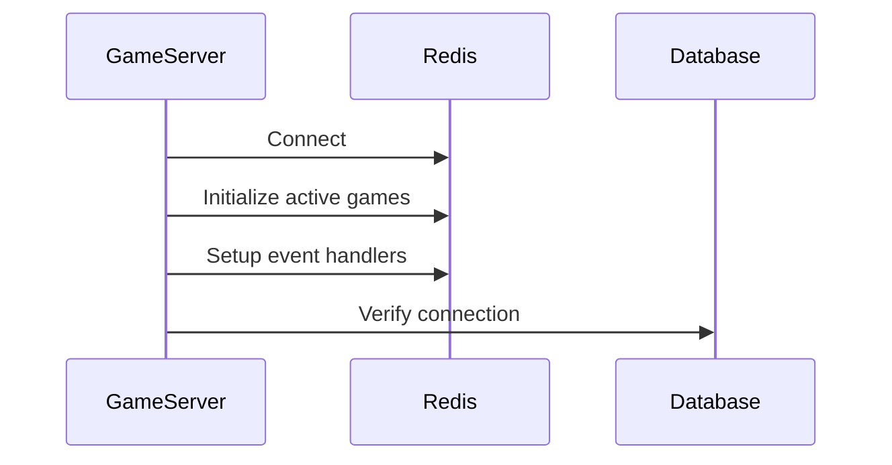
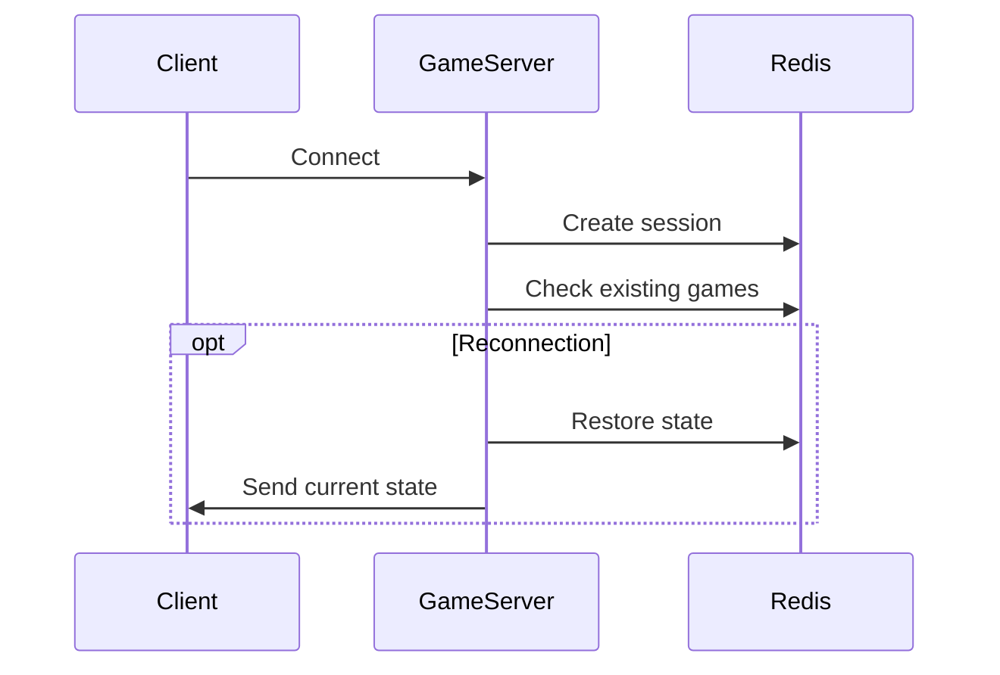
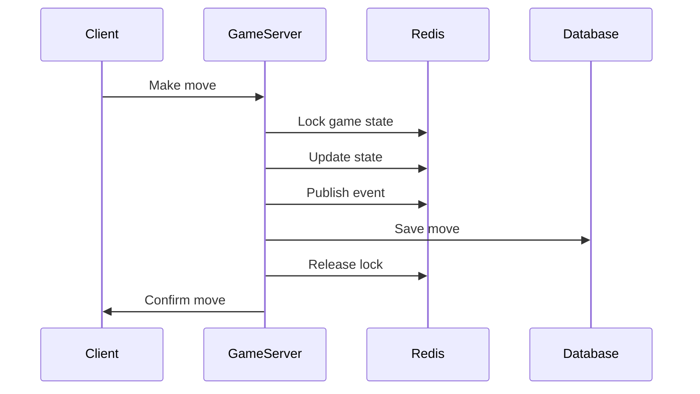

# Caching and State Management

## Redis Architecture

Redis is used as a primary state store for real-time game data and session management. This document describes the caching architecture and state management patterns used in the CTORGame project.

### Data Structures

#### Game State
```typescript
// Key: game:{gameId}:state
interface RedisGameState {
    board: number[][];           // Current board state
    currentPlayer: number;       // Active player (1 or 2)
    currentTurn: {
        placeOperationsLeft: number;  // Remaining operations in current turn
        moves: {
            type: 'place' | 'replace';
            position: IPosition;
            captures?: IPosition[];
        }[];
    };
    scores: {
        player1: number;
        player2: number;
    };
    isFirstTurn: boolean;       // First turn flag for special rules
    gameOver: boolean;          // Game over flag
    winner: number | null;      // Winner (1, 2, or null)
    lastUpdate: number;         // Last update timestamp
}
// TTL: 1 hour
```

#### Player Sessions
```typescript
// Key: player:{socketId}:session
{
    gameId: string,
    playerNumber: number,
    lastActivity: timestamp
}
// TTL: 2 hours
```

#### Game Rooms
```typescript
// Key: game:{gameId}:room
{
    players: [{
        id: string,
        number: number,
        connected: boolean
    }],
    status: 'waiting' | 'playing' | 'finished'
}
// TTL: 1 hour
```

#### Event Queue
```typescript
// Key: game:{gameId}:events
[
    {
        type: GameEventType,
        gameId: string,
        playerId: string,
        data: Record<string, any>,
        timestamp: number
    }
]

// Event Types
enum GameEventType {
    MOVE = 'move',
    DISCONNECT = 'disconnect',
    RECONNECT = 'reconnect',
    END_TURN = 'end_turn'
}

// TTL: 1 hour
```

#### Active Games
```typescript
// Key: games:active
Set<gameId>
// No TTL (managed explicitly)
```

### Usage Patterns

#### State Management
1. Real-time game state
   - Fast access to current game state
   - Atomic state updates
   - Automatic cleanup with TTL
   - Consistent state across multiple servers

2. Player Sessions
   - Track player-game associations
   - Handle reconnection scenarios
   - Manage inactivity timeouts
   - Cross-server session sharing

3. Room Management
   - Connected players tracking
   - Room status management
   - Server coordination
   - Player matchmaking

4. Event Synchronization
   - Event queue processing
   - Cross-server synchronization
   - Recent actions history
   - Replay capability

### Benefits

1. Scalability
   - Multiple game server support
   - Centralized state storage
   - Load balancing ready
   - Horizontal scaling capability

2. Reliability
   - Data persistence
   - Failure recovery
   - Network issue handling
   - Consistent state management

3. Performance
   - In-memory data access
   - Atomic operations
   - Optimized data structures
   - Low latency updates

4. Features
   - Built-in TTL mechanisms
   - Pub/Sub for real-time updates
   - Transaction support
   - Atomic operations

### Implementation Flow

#### Server Startup


#### Client Connection


#### Game Move


### Error Handling

1. Connection Issues
   - Automatic reconnection
   - State recovery
   - Session persistence
   - Client notification

2. Race Conditions
   - Atomic operations
   - State locking
   - Transaction rollback
   - Conflict resolution

3. Data Consistency
   - Version checking
   - State validation
   - Data synchronization
   - Integrity checks

### Monitoring

1. Health Metrics
   - Connected clients
   - Active games
   - Operation latency
   - Error rates

2. Performance Metrics
   - Redis memory usage
   - Command statistics
   - Network traffic
   - Cache hit rates

### Configuration

```typescript
// Redis Configuration
{
    host: string,
    port: number,
    password: string,
    retryStrategy: (times: number) => number,
    maxReconnectAttempts: number,
    connectTimeout: number
}

// TTL Configuration (seconds)
{
    gameState: 3600,    // 1 hour
    playerSession: 7200, // 2 hours
    gameRoom: 3600,     // 1 hour
    eventQueue: {
        default: 3600,  // 1 hour default TTL
        maxAge: 7200,   // 2 hours for important events
        cleanupInterval: 300 // cleanup every 5 minutes
    }
}
```

### Best Practices

1. Data Management
   - Use appropriate TTL for different data types
   - Implement cleanup routines
   - Monitor memory usage
   - Regular backup strategy

2. Error Handling
   - Implement retry mechanisms
   - Handle edge cases
   - Log errors appropriately
   - Maintain fallback options

3. Performance
   - Optimize data structures
   - Use pipelining when possible
   - Implement proper caching strategies
   - Monitor and tune as needed

4. Security
   - Secure Redis connection
   - Implement access controls
   - Regular security updates
   - Data encryption when needed