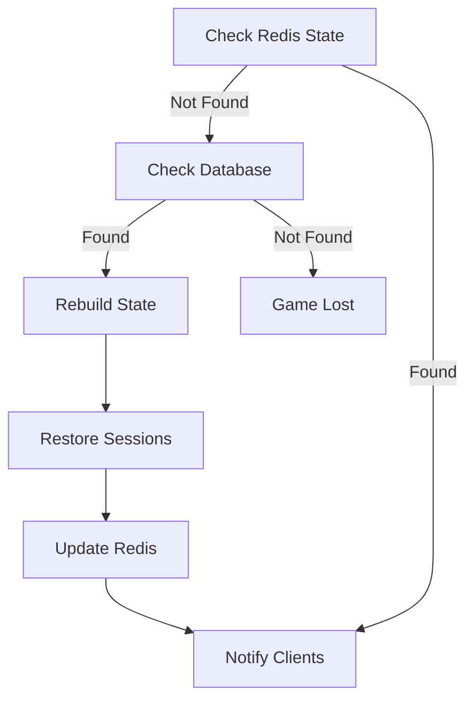

# Distributed State Management

## Overview

The CTORGame uses Redis as the primary state store for managing distributed game state across multiple server instances. This document describes the state management system, including data structures, synchronization mechanisms, and error handling.

## Data Structures

### Game State
```typescript
// Key: game:{gameId}:state
interface RedisGameState {
    board: number[][];      // Game board state
    currentPlayer: number;  // Active player (0 or 1)
    currentTurn: {
        placeOperationsLeft: number;
        moves: GameMove[];
    };
    score: {
        player1: number;
        player2: number;
    };
    gameOver: boolean;
    winner: number | null;
    lastUpdate: number;     // Timestamp
}
```

### Player Session
```typescript
// Key: player:{socketId}:session
interface RedisPlayerSession {
    gameId: string;
    playerNumber: number;
    lastActivity: number;   // Timestamp
}
```

### Game Room
```typescript
// Key: game:{gameId}:room
interface RedisGameRoom {
    players: {
        id: string;
        number: number;
    }[];
    status: 'waiting' | 'playing' | 'finished';
    lastUpdate: number;     // Timestamp
}
```

### Event Queue
```typescript
// Key: game:{gameId}:events
interface RedisGameEvent {
    type: string;
    data: any;
    timestamp: number;
}
```

## Time-To-Live (TTL) Settings

- Game State: 1 hour
- Player Session: 2 hours
- Game Room: 1 hour
- Event Queue: 1 hour
- Lock Keys: 5 seconds

## Synchronization Mechanisms

### Distributed Locks
```typescript
/**
 * Acquire a lock for game operations
 */
async function acquireLock(gameId: string, timeout = 5000): Promise<boolean> {
    const key = `game:${gameId}:lock`;
    return await redis.set(key, Date.now(), 'NX', 'PX', timeout);
}

/**
 * Execute operation with lock
 */
async function withLock<T>(gameId: string, operation: () => Promise<T>): Promise<T> {
    const locked = await acquireLock(gameId);
    if (!locked) throw new Error('Could not acquire lock');
    try {
        return await operation();
    } finally {
        await releaseLock(gameId);
    }
}
```

### State Updates
```typescript
async function updateGameState(
    gameId: string, 
    update: (state: GameState) => GameState
): Promise<GameState> {
    return await withLock(gameId, async () => {
        const state = await getGameState(gameId);
        const newState = update(state);
        await setGameState(gameId, newState);
        return newState;
    });
}
```

## Error Handling

### Common Error Scenarios

1. Lock Acquisition Failure
   - Retry with exponential backoff
   - Maximum 3 retries
   - Return error to client if all retries fail

2. State Not Found
   - Check for game expiration
   - Attempt state recovery from database
   - Return error if recovery fails

3. Concurrent Updates
   - Use optimistic locking with version check
   - Retry operation if version mismatch
   - Maximum 3 retries

4. Redis Connection Loss
   - Automatic reconnection handling
   - Queue operations during disconnect
   - Resume operations after reconnect

### Error Response Format
```typescript
interface ErrorResponse {
    code: string;          // Error code
    message: string;       // User-friendly message
    details?: any;         // Additional details
    retry?: boolean;       // Whether client should retry
}
```

## State Recovery

### Recovery Process
1. Check Redis for state
2. If not found, check database
3. Rebuild state from move history
4. Reestablish player sessions
5. Notify connected clients

### Recovery Scenarios


## Monitoring

### Key Metrics
- Active games count
- Lock acquisition success rate
- State update latency
- Redis operation errors
- Session recovery attempts
- State synchronization delays

### Health Checks
```typescript
interface RedisHealth {
    connected: boolean;
    operationsPerSecond: number;
    memoryUsage: number;
    activeConnections: number;
    lastError?: {
        message: string;
        timestamp: number;
    };
}
```

## Best Practices

1. State Updates
   - Always use locks for state modifications
   - Keep lock duration minimal
   - Validate state before updates
   - Include version in state objects

2. Error Handling
   - Implement retry mechanisms
   - Log all errors with context
   - Provide clear error messages
   - Handle edge cases gracefully

3. Performance
   - Use pipelining for multiple operations
   - Minimize lock duration
   - Clean up expired keys
   - Monitor memory usage

4. Security
   - Validate all input data
   - Use secure Redis configuration
   - Implement rate limiting
   - Monitor for suspicious patterns

## Configuration Example

```typescript
const redisConfig = {
    // Connection
    host: process.env.REDIS_HOST || 'localhost',
    port: parseInt(process.env.REDIS_PORT || '6379'),
    password: process.env.REDIS_PASSWORD,

    // Timeouts
    connectTimeout: 10000,
    commandTimeout: 5000,
    
    // Retry
    maxRetriesPerRequest: 3,
    retryStrategy: (times: number) => Math.min(times * 200, 2000),
    
    // TTL (seconds)
    ttl: {
        gameState: 3600,
        playerSession: 7200,
        gameRoom: 3600,
        eventQueue: 3600
    },
    
    // Locks
    lockTimeout: 5000,
    maxLockRetries: 3,
    
    // Monitoring
    enableMetrics: true,
    logLevel: 'info'
};
```