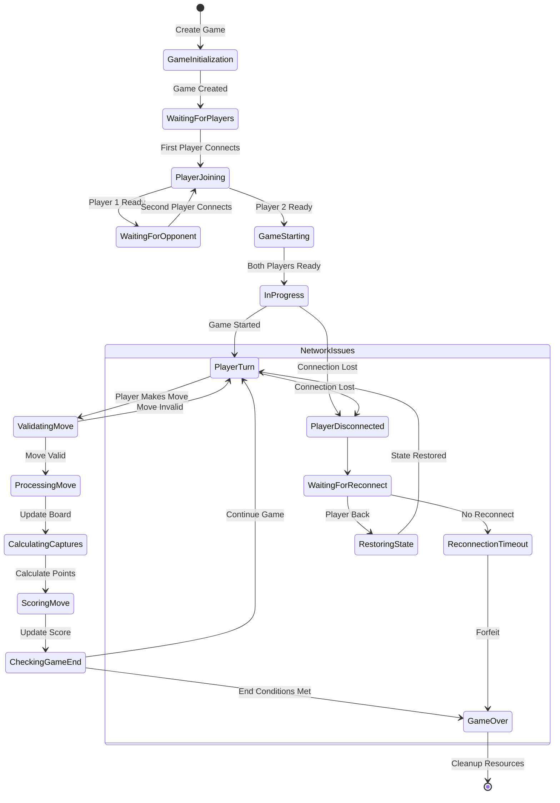
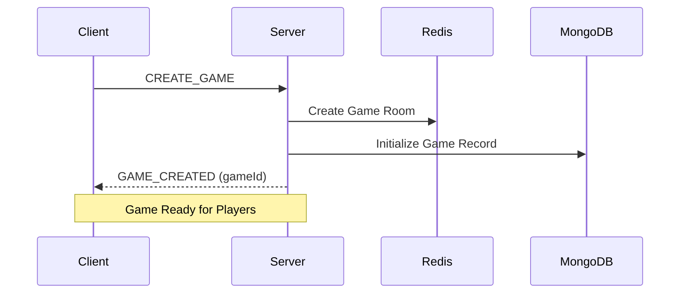
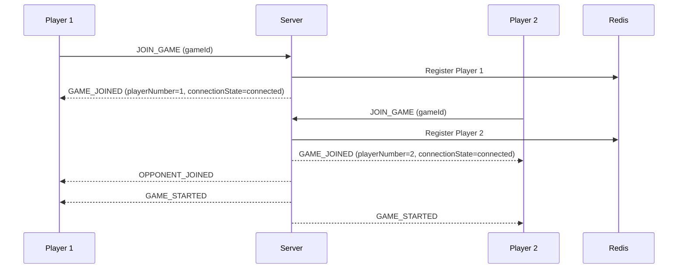
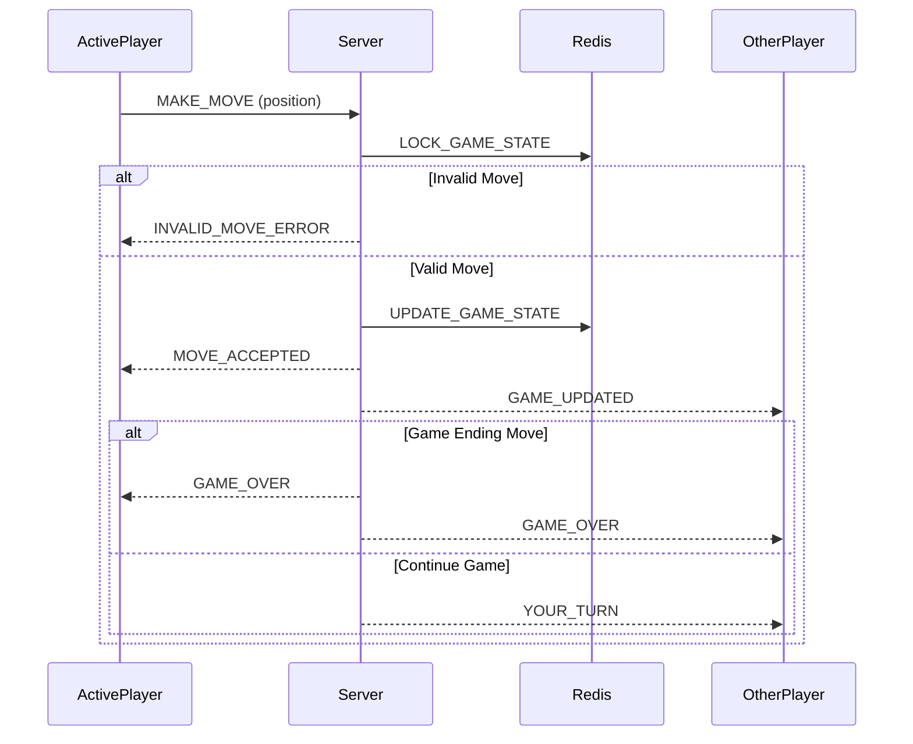
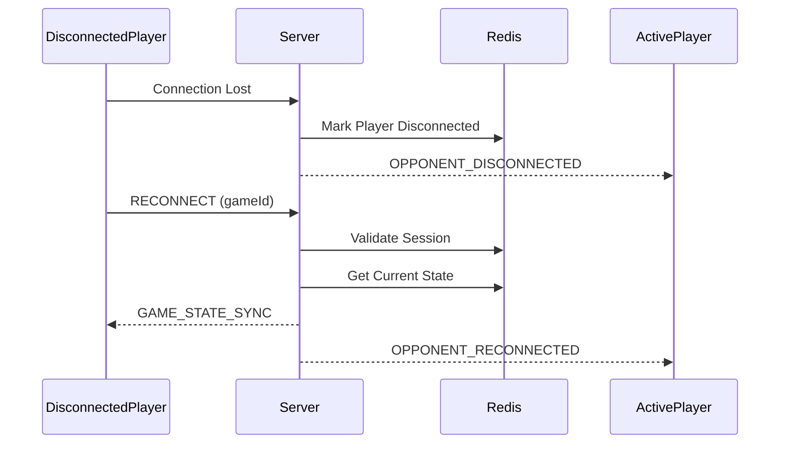

# Game Flow Documentation

## Game Lifecycle States



## Detailed State Descriptions

### 1. Game Setup Phase
- **GameInitialization**
  - Create game ID
  - Initialize empty board
  - Set up Redis game room
  - Create MongoDB game record
  
- **WaitingForPlayers**
  - Game room open
  - Waiting for player connections
  - Share game code/link

- **PlayerJoining**
  - Validate player connection
  - Assign player number
  - Initialize player session
  
- **WaitingForOpponent**
  - First player connected
  - Room joinable
  - Waiting for second player

- **GameStarting**
  - Both players connected
  - Initialize game state
  - Send initial board state
  - Determine first player

### 2. Game Active Phase
- **InProgress**
  - Game actively running
  - Players taking turns
  - State being synchronized

- **PlayerTurn**
  - Current player active
  - Awaiting move input
  - Turn timer running
  
- **ValidatingMove**
  - Check move validity
  - Verify player turn
  - Validate board position
  
- **ProcessingMove**
  - Update board state
  - Apply move rules
  - Prepare capture calculation
  
- **CalculatingCaptures**
  - Check adjacent cells
  - Apply capture rules
  - Calculate territory
  
- **ScoringMove**
  - Update player scores
  - Calculate point changes
  - Apply scoring rules
  
- **CheckingGameEnd**
  - Verify end conditions
  - Check victory conditions
  - Update game status

### 3. Network Handling Phase
- **PlayerDisconnected**
  - Detect disconnection
  - Pause game state
  - Start reconnection timer
  
- **WaitingForReconnect**
  - Hold game state
  - Keep room active
  - Monitor reconnection attempts
  
- **RestoringState**
  - Validate returning player
  - Sync game state
  - Resume game
  
- **ReconnectionTimeout**
  - Forfeit handling
  - Notify remaining player
  - Prepare game termination

### 4. Game End Phase
- **GameOver**
  - Calculate final score
  - Determine winner
  - Update player stats
  - Prepare cleanup
  
## Client-Server Interaction Flows

### 1. Game Creation Flow


### 2. Player Join Flow


### 3. Game Move Flow


### 4. Reconnection Flow


## Error Handling Matrix

| State | Error Type | Action | Recovery |
|-------|------------|---------|-----------|
| PlayerJoining | Connection Failed | Retry Join | Auto-retry 3 times |
| InProgress | Invalid Move | Return Error | Stay in current state |
| PlayerTurn | Timeout | Warning Event | Additional time once |
| ProcessingMove | State Lock Failed | Rollback | Retry operation |
| CalculatingCaptures | Calculation Error | Skip Capture | Continue game |
| Network | Disconnection | Pause Game | Wait for reconnect |
| GameOver | Save Failed | Cache Results | Retry save async |

## State Synchronization Protocol

### 1. Real-time State Update
```typescript
interface GameStateUpdate {
    type: "STATE_UPDATE";
    gameId: string;
    sequence: number;    // Incremental sequence number
    timestamp: number;   // Server timestamp
    state: {
        board: BoardState;
        currentPlayer: number;
        scores: PlayerScores;
        lastMove?: Move;
    }
}
```

### 2. State Verification
```typescript
interface StateVerification {
    type: "STATE_VERIFY";
    gameId: string;
    sequence: number;    // Client's last sequence
    hash: string;       // State hash for verification
}
```

### 3. State Synchronization
```typescript
interface StateSyncRequest {
    type: "SYNC_REQUEST";
    gameId: string;
    lastSequence: number;  // Client's last known sequence
    clientState: {
        hash: string;     // Client state hash
        timestamp: number; // Client state timestamp
    }
}
```

## Game State Persistency

### 1. Redis State (Volatile)
```typescript
interface RedisGameState {
    gameId: string;
    status: GameStatus;
    board: BoardState;
    currentPlayer: number;
    sequence: number;
    lastUpdate: number;
    players: {
        [playerNumber: number]: {
            connected: boolean;
            lastSeen: number;
        }
    }
}
```

### 2. MongoDB State (Persistent)
```typescript
interface MongoGameRecord {
    gameId: string;
    status: GameStatus;
    startTime: Date;
    endTime?: Date;
    players: PlayerRecord[];
    moves: Move[];
    finalScore?: Score;
    winner?: number;
}
```

## Event Protocol Version Matrix

| Version | Events | States | Backwards Compatible |
|---------|---------|---------|---------------------|
| 1.0 | Basic moves | Simple states | N/A |
| 1.1 | Added captures | Capture states | Yes |
| 1.2 | Reconnection | Network states | Yes |
| 2.0 | Advanced moves | All current | No |