# Game Flow Documentation

## Game Lifecycle States

```mermaid
stateDiagram-v2
    [*] --> INITIAL: Initialize
    INITIAL --> CONNECTING: Create/Join Game
    CONNECTING --> WAITING: Connection Established
    CONNECTING --> INITIAL: Connection Failed
    WAITING --> PLAYING: Opponent Joined
    WAITING --> INITIAL: Timeout/Cancel
    WAITING --> CONNECTING: Reconnect
    PLAYING --> FINISHED: Game Over
    FINISHED --> INITIAL: Reset
    
    state ERROR {
        ERROR --> INITIAL: Reset
    }
    
    PLAYING --> ERROR: Game Error
    CONNECTING --> ERROR: Connection Error
    WAITING --> ERROR: Room Error
    
    state NetworkHandling {
        CONNECTING --> Disconnected: Connection Lost
        Disconnected --> CONNECTING: Reconnect Attempt
        Disconnected --> FINISHED: Timeout
    }
```

## Detailed State Descriptions

### 1. Core Game States

- **INITIAL**
  - Default state before game creation
  - No active game or connection
  - System ready for new game

- **CONNECTING**
  - Attempting to establish connection
  - Creating or joining a game
  - Connection handshake in progress
  - Initial game room setup

- **WAITING**
  - Connected to server
  - Game room created
  - Waiting for opponent
  - Share game code/link

- **PLAYING**
  - Active gameplay
  - Both players connected
  - Turn-based moves
  - State synchronization active

- **FINISHED**
  - Game completed
  - Final score calculated
  - Winner determined
  - Ready for cleanup

### 2. Special States

- **ERROR**
  - Error condition detected
  - Game in inconsistent state
  - Recovery action needed
  - Error details available

### 3. Network Handling States

- **Disconnected**
  - Connection lost
  - Attempting reconnection
  - State preservation
  - Timeout monitoring

### 4. State Recovery Actions

- **Connection Recovery**
  - Automatic reconnection attempts
  - Session validation
  - State synchronization
  - Game state restoration

- **Error Recovery**
  - Error analysis
  - State validation
  - Fallback mechanisms
  - Recovery notifications

### 5. State Validation

Each state transition includes:
- Validation of current state
- Permission checks
- State consistency verification
- Error handling procedures
  
## Client-Server Interaction Flows

### 1. Game Creation Flow


### 2. Player Join Flow


### 3. Game Move Flow

```mermaid
sequenceDiagram
    participant ActivePlayer
    participant Server
    participant OtherPlayer
    
    Note over ActivePlayer,OtherPlayer: State: PLAYING
    ActivePlayer->>Server: makeMove (gameId, move)
    
    alt Invalid Move
        Server-->>ActivePlayer: error (INVALID_MOVE)
    else Valid Move
        Server-->>ActivePlayer: gameStateUpdated (phase=PLAYING)
        Server-->>OtherPlayer: gameStateUpdated (phase=PLAYING)
        
        opt Available Replacements
            Server-->>ActivePlayer: availableReplaces (moves)
        end
        
        opt Game Over
            Server-->>ActivePlayer: gameOver
            Server-->>OtherPlayer: gameOver
            Note over ActivePlayer,OtherPlayer: State: FINISHED
        end
    end
```


### 4. Network Handling Flow


## Error Handling Matrix

| State | Error Type | Action | Recovery |
|-------|------------|---------|-----------|
| INITIAL | Invalid Event | Ignore | N/A |
| CONNECTING | Connection Failed | Retry | Return to INITIAL |
| WAITING | Room Full | Error | Return to INITIAL |
| PLAYING | Invalid Move | Error | Stay in PLAYING |
| PLAYING | Connection Lost | Error | Try reconnect |
| FINISHED | Save Failed | Cache | Retry async |
| ERROR | Any | Log | Reset to INITIAL |

## State Synchronization Protocol

### 1. Game State Update
```typescript
interface GameStateUpdate {
    gameState: IGameState;
    currentPlayer: number;
    phase: GamePhase;
}
```

### 2. Game Event Structure
```typescript
interface WebSocketEvent<T> {
    type: WebSocketEvents;
    gameId: string;
    eventId: string;
    phase?: GamePhase;
    payload: T;
}
```

### 3. Connection States
```typescript
enum GamePhase {
    INITIAL = 'INITIAL',
    CONNECTING = 'CONNECTING',
    WAITING = 'WAITING',
    PLAYING = 'PLAYING',
    FINISHED = 'FINISHED',
    ERROR = 'ERROR'
}
```

## Game State Persistence

### 1. Server State (Redis)
```typescript
interface RedisGameState {
    gameId: string;
    phase: GamePhase;
    gameState: IGameState;
    players: IPlayer[];
    lastUpdate: number;
    currentPlayer: number;
}
```

### 2. Client State (Storage)
```typescript
interface ClientGameState {
    gameId: string | null;
    phase: GamePhase;
    playerNumber: number | null;
    gameState: IGameState | null;
    error: GameError | null;
    connectionState: ConnectionState;
}
```

## Event Protocol Summary

### Core Events
- **createGame**: Create new game room
- **gameCreated**: Game room created
- **joinGame**: Join existing game
- **gameJoined**: Successfully joined game
- **gameStarted**: Game begins
- **gameStateUpdated**: State change
- **gameOver**: Game finished

### Error Events
- **error**: General error
- **playerDisconnected**: Connection lost
- **playerReconnected**: Connection restored

### State Events
- Phase transitions
- Player turns
- Game updates
- Connection status