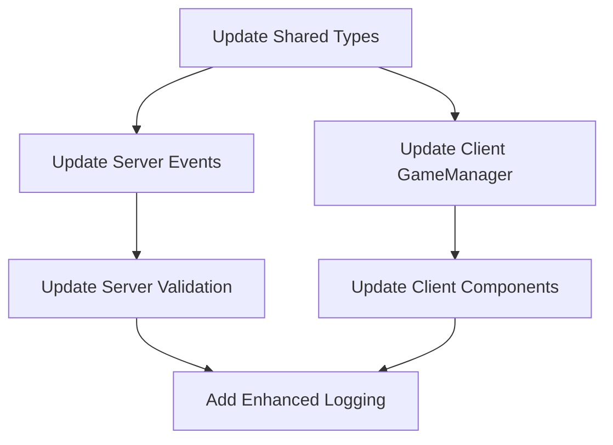

# State Management Migration Plan

## Overview
This document outlines the plan for migrating the current state management approach to a hybrid solution using a centralized GameStateManager for core game state while maintaining component-local state for UI concerns.

## Goals
- Improve state management predictability
- Reduce state-related bugs
- Maintain simple debugging capabilities
- Keep the codebase maintainable
- Minimize impact on existing functionality
- Ensure backward compatibility during migration
- Maintain synchronization between client, server, and shared code

## Migration Phases

### Phase 1: Infrastructure Setup (Foundation)
1. Create base GameStateManager class
   - Implement singleton pattern
   - Add basic state structure
   - Setup connection management
   ```typescript
   class GameStateManager {
     private static instance: GameStateManager;
     private state = {
       connectionState: 'CONNECTING',
       gameId: null,
       playerNumber: null,
       gamePhase: 'INITIAL'
     };

     public static getInstance() {
       if (!GameStateManager.instance) {
         GameStateManager.instance = new GameStateManager();
       }
       return GameStateManager.instance;
     }
   }
   ```

2. Implement basic socket handling
   - Move socket initialization to GameStateManager
   - Setup basic connection events
   ```typescript
   private setupBaseSocketHandlers() {
     this.socket.on('connect', this.handleConnect);
     this.socket.on('disconnect', this.handleDisconnect);
     this.socket.on('error', this.handleError);
   }
   ```

3. Create useGame hook
   - Basic state subscription
   - Essential game actions
   ```typescript
   function useGame() {
     const [gameState, setGameState] = useState(null);
     const manager = useMemo(() => GameStateManager.getInstance(), []);

     useEffect(() => {
       return manager.subscribe(setGameState);
     }, []);

     return {
       gameState,
       createGame: manager.createGame.bind(manager),
       joinGame: manager.joinGame.bind(manager)
     };
   }
   ```

### Phase 2: Component Migration (Iterative)
1. WaitingRoom Component Migration
   - Move game creation/joining logic to GameStateManager
   - Keep UI-specific state in component
   - Update component to use useGame hook
   ```typescript
   function WaitingRoom() {
     const { gameState, createGame, joinGame } = useGame();
     const [copied, setCopied] = useState(false);
     // UI-specific logic remains in component
   }
   ```

2. GameBoard Component Migration
   - Move game state management to GameStateManager
   - Keep animation and selection state in component
   - Update event handlers to use manager methods

3. Update other components following the same pattern

### Phase 3: State Synchronization
1. Implement proper state updates
   - Add validation
   - Handle race conditions
   - Implement proper error handling
   ```typescript
   class GameStateManager {
     private updateState(newState: Partial<State>) {
       // Validate state update
       if (!this.isValidStateTransition(newState)) {
         throw new Error('Invalid state transition');
       }
       
       this.state = { ...this.state, ...newState };
       this.notifySubscribers();
     }
   }
   ```

2. Add state persistence where needed
   - Implement localStorage backup
   - Add state recovery logic
   ```typescript
   class GameStateManager {
     private persistState() {
       localStorage.setItem('gameState', JSON.stringify(this.state));
     }

     private restoreState() {
       const saved = localStorage.getItem('gameState');
       if (saved) {
         this.state = JSON.parse(saved);
       }
     }
   }
   ```

### Phase 4: Testing & Documentation
1. Add unit tests for GameStateManager
   ```typescript
   describe('GameStateManager', () => {
     let manager: GameStateManager;

     beforeEach(() => {
       manager = GameStateManager.getInstance();
     });

     it('should handle game creation', () => {
       manager.createGame();
       expect(manager.getState().gamePhase).toBe('WAITING');
     });
   });
   ```

2. Add integration tests for components with new state management
3. Update component tests to use mocked GameStateManager
4. Document new patterns and best practices

## Required Changes in Shared and Server Parts

### Shared Module Updates

The shared module requires updates to support the new state management architecture:

1. New Types and Interfaces:
```typescript
// shared/types/gameState.ts
export type GamePhase = 
  | 'INITIAL'
  | 'CONNECTING'
  | 'WAITING'
  | 'PLAYING'
  | 'GAME_OVER';

export interface GameManagerState {
  phase: GamePhase;
  gameId: string | null;
  playerNumber: Player | null;
  error: GameError | null;
  connectionState: ConnectionState;
}

export interface GameStateUpdate {
  gameState: IGameState;
  eventId: string;
  phase: GamePhase;
}
```

2. New Validators:
```typescript
// shared/validation/stateValidation.ts
export function validateGamePhase(phase: GamePhase): boolean {
  return ['INITIAL', 'CONNECTING', 'WAITING', 'PLAYING', 'GAME_OVER'].includes(phase);
}

export function validateGameManagerState(state: GameManagerState): boolean {
  return (
    validateGamePhase(state.phase) &&
    (state.gameId === null || typeof state.gameId === 'string') &&
    (state.playerNumber === null || validatePlayerNumber(state.playerNumber))
  );
}
```

### Server Updates

Server part requires minimal changes to support the new architecture:

1. Extended Event Types:
```typescript
// server/src/types/events.ts
interface GameStartedEvent {
  gameState: IGameState;
  currentPlayer: Player;
  eventId: string;
  phase: GamePhase;  // new field
}
```

2. Enhanced Validation:
```typescript
// server/src/services/gameService.ts
class GameService {
  private validateGameTransition(
    currentPhase: GamePhase,
    newPhase: GamePhase,
    gameState: IGameState
  ): boolean {
    switch(currentPhase) {
      case 'WAITING':
        return newPhase === 'PLAYING' || newPhase === 'GAME_OVER';
      case 'PLAYING':
        return newPhase === 'GAME_OVER';
      // ...
    }
  }
}
```

3. Improved Logging:
```typescript
// server/src/services/loggingService.ts
interface GameStateChangeLog {
  previousPhase: GamePhase;
  newPhase: GamePhase;
  gameId: string;
  timestamp: number;
  playerId: string;
  reason: string;
}
```

### Migration Order



### Implementation Steps

1. Shared Updates (Phase 1):
   - Add new types with backward compatibility
   - Update existing interfaces
   - Add new validators
   ```typescript
   // Example of backward compatible changes
   interface GameEvent {
     phase?: GamePhase; // optional for backward compatibility
     // existing fields
   }
   ```

2. Server Updates (Phase 2):
   - Extend event structures
   - Add phase validation
   - Enhance logging
   ```typescript
   class GameServer {
     private emitGameStarted(socket: Socket, gameState: IGameState) {
       socket.emit('gameStarted', {
         gameState,
         phase: 'PLAYING', // add new field
         // existing fields
       });
     }
   }
   ```

3. Client Updates (Phase 3):
   - Implement GameStateManager
   - Update components
   - Add new hooks
   ```typescript
   class GameStateManager {
     private handleGameStarted(event: GameStartedEvent) {
       const phase = event.phase || 'PLAYING';
       this.updateState({ phase });
     }
   }
   ```

### Compatibility Considerations

1. Backward Compatibility:
   - Make new fields optional initially
   - Provide default values for missing fields
   - Add fallback logic in client code

2. Deployment Strategy:
   - Deploy shared module updates first
   - Update server with backward compatibility
   - Roll out client changes
   - Make new fields mandatory after full deployment

3. Testing Requirements:
   - Test with old and new client versions
   - Verify event handling with and without new fields
   - Check state transitions in all scenarios

## Success Criteria
- All game-related state managed through GameStateManager
- Component tests passing
- No regressions in existing functionality
- Improved debugging capabilities
- Reduced number of state-related bugs

## Rollback Plan
Each phase can be rolled back independently by:
1. Reverting the specific component changes
2. Restoring original state management
3. Removing GameStateManager class
4. Reverting to original socket handling

## Timeline
- Phase 1: 1-2 days
- Phase 2: 2-3 days (per component)
- Phase 3: 2-3 days
- Phase 4: 2-3 days

## Testing Strategy
1. Unit Tests
   - GameStateManager core functionality
   - State transitions
   - Event handling

2. Integration Tests
   - Component interaction with GameStateManager
   - State synchronization
   - Error handling

3. End-to-End Tests
   - Full game flow
   - Connection handling
   - State persistence

## Monitoring & Metrics
1. Track state-related errors
2. Monitor performance impacts
3. Track state transition timings
4. Monitor memory usage

## Risks & Mitigations
| Risk | Mitigation |
|------|------------|
| State desynchronization | Implement validation and recovery mechanisms |
| Performance degradation | Monitor and optimize state updates |
| Breaking changes | Comprehensive testing before each phase |
| Memory leaks | Proper cleanup in useGame hook |

## Development Guidelines
1. State Updates
   ```typescript
   // Do: Use manager methods
   gameManager.makeMove(move);
   
   // Don't: Modify state directly
   gameState.moves.push(move);
   ```

2. Component State
   ```typescript
   // Do: Keep UI state in components
   const [isAnimating, setAnimating] = useState(false);
   
   // Don't: Put UI state in manager
   gameManager.setAnimating(true);
   ```

3. Event Handling
   ```typescript
   // Do: Use manager methods
   const handleClick = () => gameManager.handleCellClick(cell);
   
   // Don't: Handle game logic in components
   const handleClick = () => setGameState({ ...gameState, selected: cell });
   ```

## Migration Status Tracking

### Completed Features ✅
| Feature | Notes |
|---------|-------|
| Phase 1 - Infrastructure | Base GameStateManager, Socket handling, useGame hook |
| Shared Types | GamePhase, GameManagerState, GameStateUpdate |
| Type System | Full typing coverage with proper interfaces |
| State Management | Basic implementation with subscription system |
| Available Replaces | Full handling with type support |
| Promise Support | Fully implemented for joinGame with timeout and error handling |
| Client Error Handling | Basic implementation for join operations |
| Game State Validation | Full runtime validation with recovery |
| State Transitions | Validation and error handling |
| State Recovery | Automatic recovery from validation errors |
| WaitingRoom Migration | Complete with Promise support and error handling |

### In Progress 🟡
| Feature | Status | Next Steps |
|---------|--------|------------|
| Local Storage | 15% | Implement state persistence layer |
| Error Recovery | 85% | Add global error handler |
| Component Migration | 40% | Start GameNew migration |
| State Persistence | 10% | Design storage structure |

### Pending Tasks ⏳
| Task | Priority | Dependencies |
|------|----------|--------------|
| Race Condition Handling | Medium | Local Storage |
| Server Integration | Low | Client Migration |
| Component Tests | High | Component Migration |
| Performance Optimization | Low | Core Features |

### Component Migration Status
| Component | Status | Blocking Issues |
|-----------|--------|----------------|
| WaitingRoom | ✅ Done | None |
| GameNew | 🟡 In Progress | Local Storage Integration |
| GameBoard | ⏳ Pending | GameNew Completion |
| GameControls | ⏳ Pending | GameBoard Completion |

### State Persistence Plan
| Feature | Priority | Status |
|---------|----------|---------|
| Storage Layer | High | Planning |
| Version Control | High | Planning |
| Migration System | Medium | Not Started |
| Auto-Save | High | Not Started |
| Cleanup | Low | Not Started |
| Recovery | High | Not Started |

### Next Priority Tasks
1. Local Storage Implementation
   - Add state persistence layer:
     ```typescript
     interface StorageConfig {
       prefix: string;
       ttl: number;
       version: string;
     }

     class StateStorage {
       saveState(key: string, state: any): void;
       loadState<T>(key: string): T | null;
       cleanupExpired(): void;
     }
     ```
   - Implement state versioning:
     ```typescript
     interface StoredState<T> {
       version: string;
       timestamp: number;
       data: T;
     }
     ```
   - Add migration strategies for старых версий:
     ```typescript
     type MigrationStrategy = (oldState: any) => ExtendedGameManagerState;
     ```
   - Добавить механизм очистки устаревших данных
   - Реализовать автоматическое сохранение при изменениях
   - Добавить восстановление состояния при инициализации
   - Создать тесты для хранилища

2. GameNew Component Migration
   - Обновить для использования GameStateManager
   - Добавить восстановление состояния
   - Улучшить обработку ошибок
   - Добавить индикаторы загрузки

3. Error Recovery Improvements
   - Добавить глобальный обработчик ошибок
   - Улучшить логирование
   - Добавить механизм автоматических повторных попыток

## Future Considerations
1. State persistence improvements
2. Performance optimizations
3. Additional debugging tools
4. State replay capabilities
5. Time-travel debugging

## References
- Current architecture documentation
- React state management best practices
- Socket.IO documentation
- Testing strategies