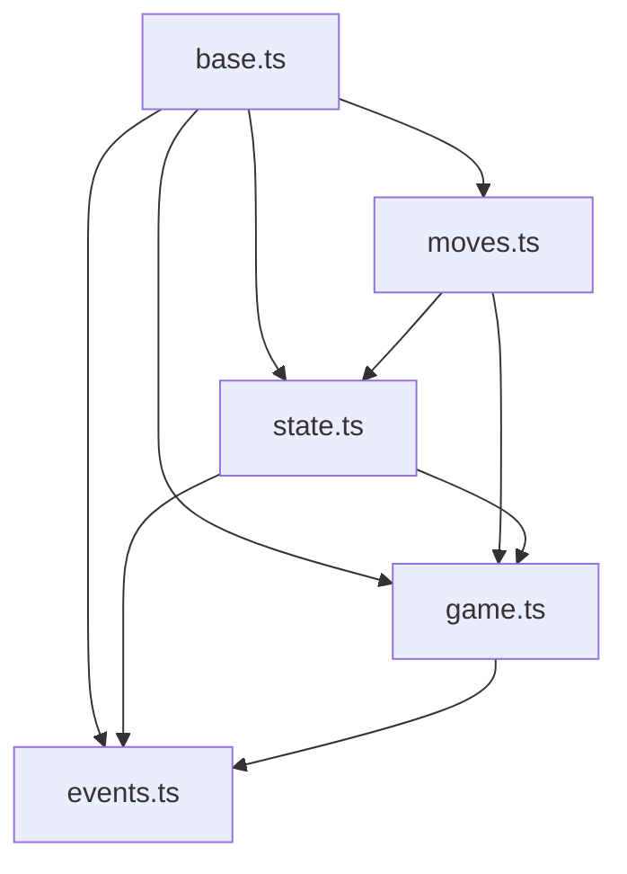
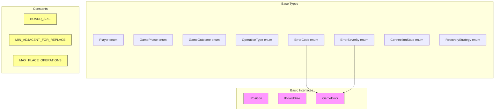
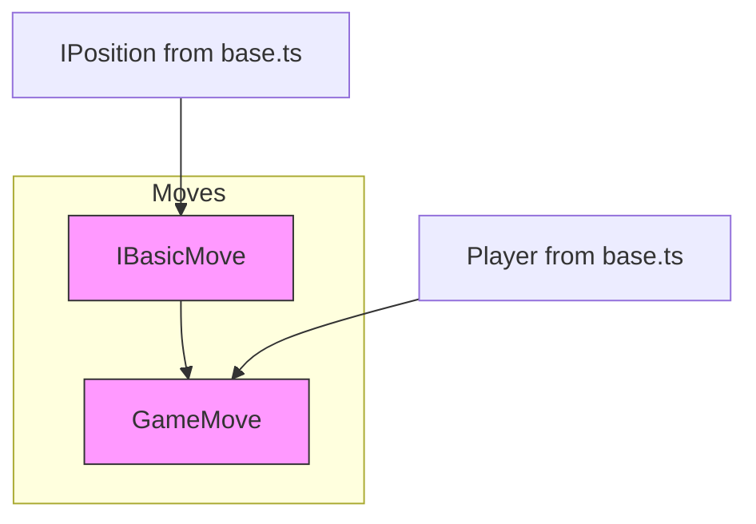
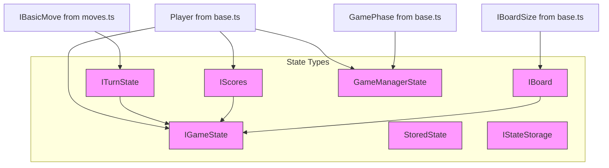
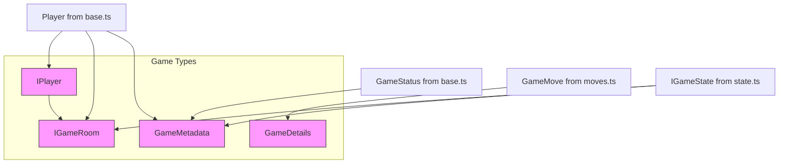
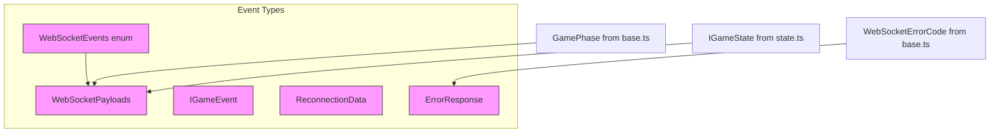
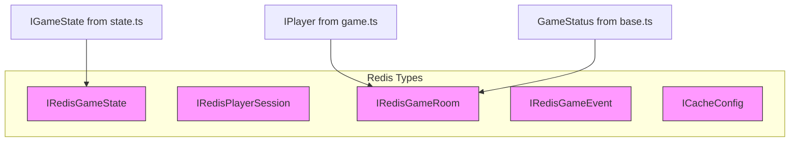

# Type Dependencies in Shared Module

## Type Files Hierarchy

## Detailed Type Dependencies

### base.ts - Foundation Types

### moves.ts - Move Types

### state.ts - State Types

### game.ts - Game Entity Types

### events.ts - Event Types

## Additional Types

### Redis Types

## Type Organization Guidelines

1. **Base Types (base.ts)**
   - Contains fundamental enums, interfaces and constants
   - No dependencies on other type files
   - Used throughout the application

2. **Move Types (moves.ts)**
   - Contains move-related types
   - Depends only on base.ts
   - Separates basic move structure from game-specific moves

3. **State Types (state.ts)**
   - Contains game state related interfaces
   - Depends on base.ts and moves.ts
   - Manages game state and turn information

4. **Game Types (game.ts)**
   - Contains game entity interfaces
   - Depends on base.ts, moves.ts, and state.ts
   - Defines game-specific structures

5. **Event Types (events.ts)**
   - Contains WebSocket and event-related types
   - Can depend on all other type files
   - Handles communication between client and server

## Rules for Adding New Types

1. **Dependency Direction**
   - Types should follow the hierarchy: base → moves → state → game → events
   - No circular dependencies allowed
   - If a type could belong to multiple files, place it in the earlier file in the hierarchy

2. **File Organization**
   - Group related types together
   - Use explicit exports
   - Document complex type relationships
   - Keep interfaces focused and single-purpose

3. **Type Sharing**
   - Share types through the main index.ts
   - Use explicit imports rather than deep imports
   - Maintain backward compatibility when modifying shared types

4. **Validation**
   - Validate type changes across both client and server
   - Update documentation when adding or modifying types
   - Consider impact on existing type relationships