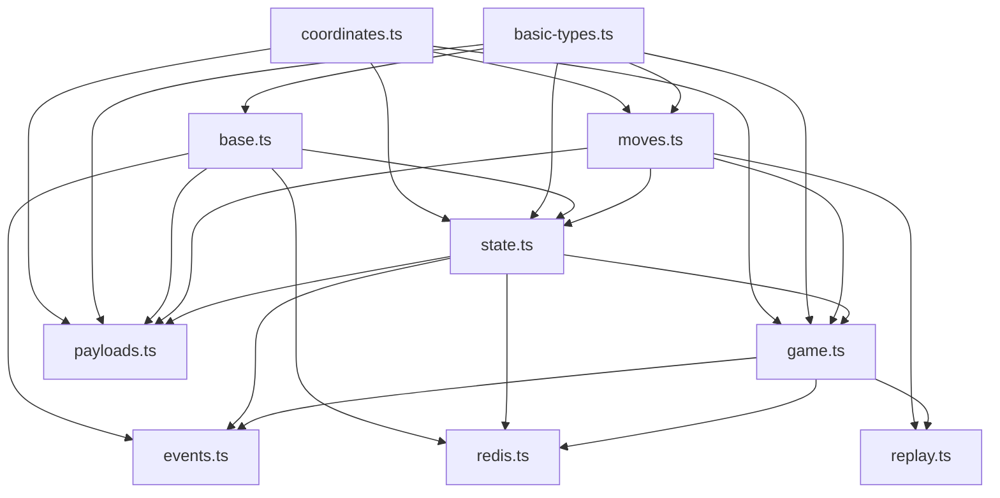
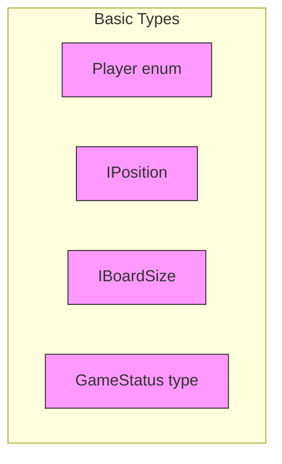
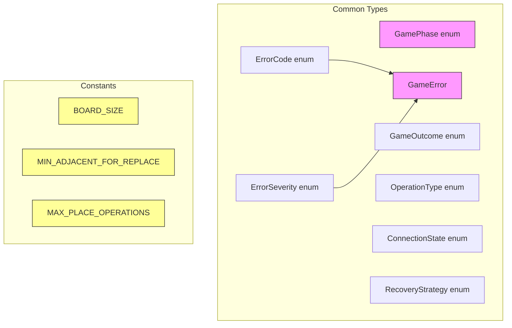
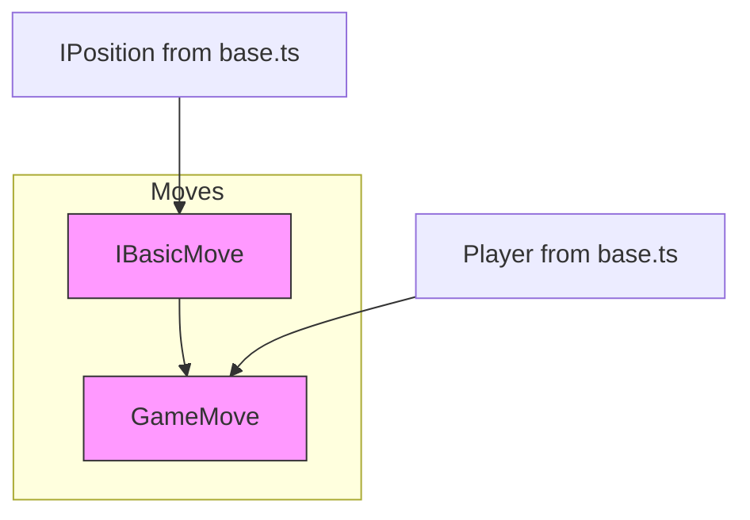
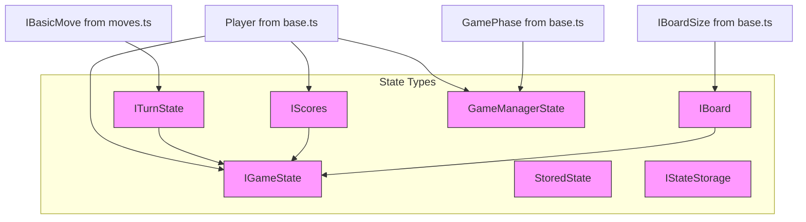
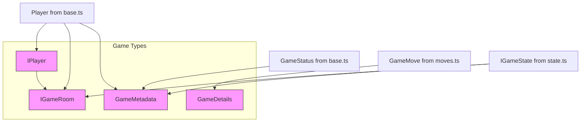
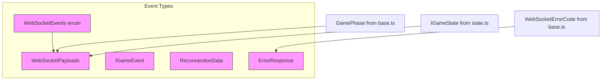
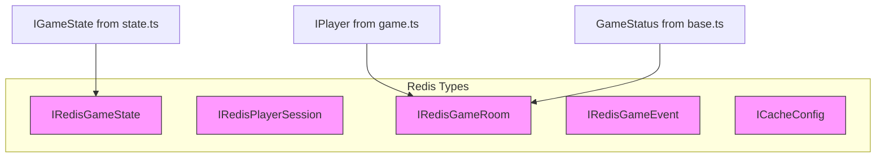

# Type Dependencies in Shared Module

## Type Files Hierarchy

## Module Organization

1. **basic-types.ts - Core Types**
   - Contains the most fundamental types with no dependencies
   - Includes Player enum, IPosition, IBoardSize, and GameStatus
   - Used throughout the application
   - Never imports from other type files

2. **base.ts - Common Types**
   - Imports basic types from basic-types.ts
   - Contains game phases, error types, and constants
   - Provides common types used across the application
   - Only depends on basic-types.ts

3. **moves.ts - Move Types**
   - Imports only from basic-types.ts
   - Defines basic move structure
   - Contains move validation types
   - Used by game and state modules

4. **state.ts - State Types**
   - Imports from basic-types.ts, base.ts, and moves.ts
   - Contains game state interfaces
   - Manages board and score types
   - Central to game state management

5. **game.ts - Game Entity Types**
   - Imports from basic-types.ts, state.ts, and moves.ts
   - Defines game room and player structures
   - Handles game metadata and details
   - Connects players with game state

6. **payloads.ts - Communication Types**
   - Imports from multiple modules
   - Contains WebSocket message types
   - Defines client-server communication structure
   - Used by events module

7. **events.ts - Event Types**
   - Top-level module for WebSocket events
   - Imports from base.ts, state.ts, and moves.ts
   - Defines event handlers and callbacks
   - Handles WebSocket communication types

8. **coordinates.ts - Coordinate System Types**
   - No external dependencies (foundational module)
   - Contains core types for board representation (IPosition, IBoardSize, IBoard)
   - Used extensively throughout the application
   - Essential for game state and move validation

9. **redis.ts - Redis Storage Types**
   - Imports from state.ts, game.ts, and base.ts
   - Contains Redis-specific data structures
   - Defines interfaces for data persistence
   - Handles game state storage types

10. **replay.ts - Game Replay Types**
    - Imports from game.ts and moves.ts
    - Contains types for game replay functionality
    - Manages game history and playback
    - Handles replay state management

## Type Dependency Guidelines

1. **Dependency Direction**
   - Types should flow from basic-types.ts outward
   - Each module should only import from modules "below" it in hierarchy
   - No circular dependencies allowed
   - Events module should be the final consumer

2. **Import Organization**
   - Import from basic-types.ts first
   - Group imports by source module
   - Use explicit imports
   - Avoid deep imports from nested structures

3. **Type Placement**
   - Place new types in the most appropriate module
   - Consider dependencies when choosing module
   - Keep related types together
   - Avoid creating new dependencies

4. **Breaking Changes**
   - Changes to basic-types.ts affect all modules
   - Consider impact on dependent modules
   - Update all affected modules
   - Maintain backward compatibility where possible

## Detailed Type Dependencies

### Basic Types (basic-types.ts)

### Common Types (base.ts)

### moves.ts - Move Types

### state.ts - State Types

### game.ts - Game Entity Types

### events.ts - Event Types

## Additional Types

### Redis Types

## Type Organization Guidelines

1. **Base Types (base.ts)**
   - Contains fundamental enums, interfaces and constants
   - No dependencies on other type files
   - Used throughout the application

2. **Move Types (moves.ts)**
   - Contains move-related types
   - Depends only on base.ts
   - Separates basic move structure from game-specific moves

3. **State Types (state.ts)**
   - Contains game state related interfaces
   - Depends on base.ts and moves.ts
   - Manages game state and turn information

4. **Game Types (game.ts)**
   - Contains game entity interfaces
   - Depends on base.ts, moves.ts, and state.ts
   - Defines game-specific structures

5. **Event Types (events.ts)**
   - Contains WebSocket and event-related types
   - Can depend on all other type files
   - Handles communication between client and server

## Rules for Adding New Types

1. **Dependency Direction**
   - Types should follow the hierarchy: base → moves → state → game → events
   - No circular dependencies allowed
   - If a type could belong to multiple files, place it in the earlier file in the hierarchy

2. **File Organization**
   - Group related types together
   - Use explicit exports
   - Document complex type relationships
   - Keep interfaces focused and single-purpose

3. **Type Sharing**
   - Share types through the main index.ts
   - Use explicit imports rather than deep imports
   - Maintain backward compatibility when modifying shared types

4. **Validation**
   - Validate type changes across both client and server
   - Update documentation when adding or modifying types
   - Consider impact on existing type relationships

### payloads.ts - WebSocket Communication Types

```mermaid
graph TD
    subgraph Basic Payload Types
        BasicPosition[BasicPosition]
        BasicMove[BasicMove]
        BaseGamePayload[BaseGamePayload]
        style BasicPosition fill:#f9f,stroke:#333
        style BasicMove fill:#f9f,stroke:#333
        style BaseGamePayload fill:#f9f,stroke:#333
    end

    subgraph Server Response Payloads
        GameCreatedPayload[GameCreatedPayload]
        GameJoinedPayload[GameJoinedPayload]
        GameStartedPayload[GameStartedPayload]
        GameStateUpdatedPayload[GameStateUpdatedPayload]
        GameOverPayload[GameOverPayload]
        PlayerPayloads[Player*Payloads]
        ErrorPayload[ErrorPayload]
        style GameCreatedPayload fill:#f9f,stroke:#333
        style GameJoinedPayload fill:#f9f,stroke:#333
        style GameStartedPayload fill:#f9f,stroke:#333
        style GameStateUpdatedPayload fill:#f9f,stroke:#333
        style GameOverPayload fill:#f9f,stroke:#333
        style PlayerPayloads fill:#f9f,stroke:#333
        style ErrorPayload fill:#f9f,stroke:#333
    end

    subgraph Client Request Payloads
        JoinGamePayload[JoinGamePayload]
        MakeMovePayload[MakeMovePayload]
        EndTurnPayload[EndTurnPayload]
        ReconnectPayload[ReconnectPayload]
        style JoinGamePayload fill:#f9f,stroke:#333
        style MakeMovePayload fill:#f9f,stroke:#333
        style EndTurnPayload fill:#f9f,stroke:#333
        style ReconnectPayload fill:#f9f,stroke:#333
    end

    BasicPosition --> BasicMove
    BaseGamePayload --> GameCreatedPayload
    BaseGamePayload --> GameJoinedPayload
    BaseGamePayload --> GameStartedPayload
    BaseGamePayload --> GameStateUpdatedPayload
    BaseGamePayload --> GameOverPayload
    BasicMove --> MakeMovePayload
```

The payloads.ts file contains types specifically for WebSocket communication between client and server. It helps break circular dependencies by separating communication-specific types from core game types. The file is organized into three main sections:

1. **Basic Payload Types**: Foundation types used by other payload types
   - BasicPosition: Simple x,y coordinates
   - BasicMove: Basic move structure without game-specific details
   - BaseGamePayload: Common fields for game-related messages

2. **Server Response Payloads**: Types for server->client messages
   - Game state updates
   - Player connection events
   - Error responses

3. **Client Request Payloads**: Types for client->server messages
   - Game actions
   - Connection management

This separation allows for cleaner type dependencies and better maintainability.