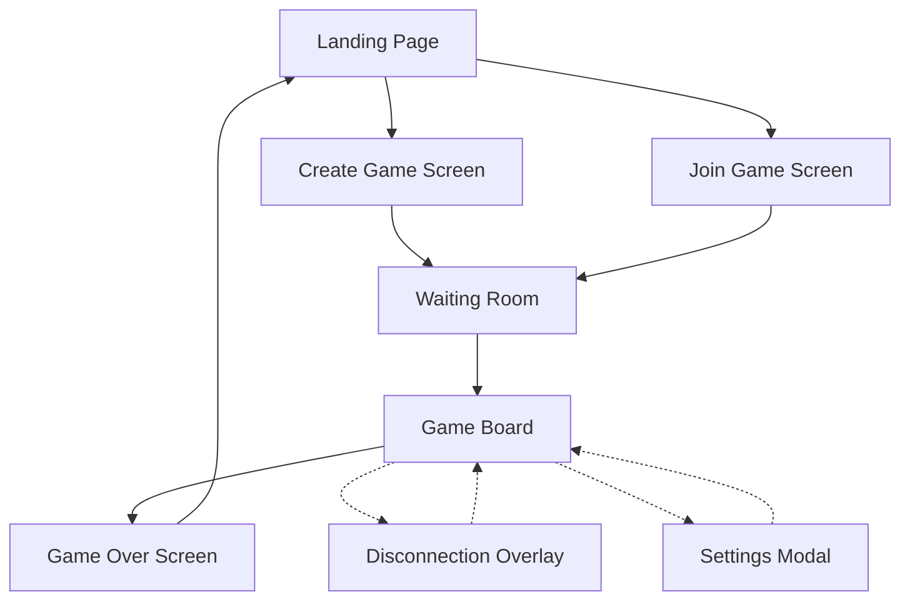

# User Interface Documentation

## Screen Flow Diagram


## Screen Layouts

### 1. Landing Page
```
+---------------------------+
|        CTOR GAME          |
|---------------------------|
|                          |
|     +-------------+      |
|     | CREATE GAME |      |
|     +-------------+      |
|                          |
|     +-------------+      |
|     | JOIN GAME   |      |
|     +-------------+      |
|                          |
|     Game Rules Link      |
|                          |
+---------------------------+
```

### 2. Create Game Screen
```
+---------------------------+
|        CTOR GAME          |
|---------------------------|
|                          |
|   Your Game Code:        |
|   +----------------+     |
|   |   ABC123       |     |
|   +----------------+     |
|                          |
|   Share this code with   |
|   your opponent          |
|                          |
|   Waiting for player...  |
|                          |
|   +-------------+        |
|   | CANCEL      |        |
|   +-------------+        |
+---------------------------+
```

### 3. Join Game Screen
```
+---------------------------+
|        CTOR GAME          |
|---------------------------|
|                          |
|   Enter Game Code:       |
|   +----------------+     |
|   |                |     |
|   +----------------+     |
|                          |
|   +-------------+        |
|   | JOIN        |        |
|   +-------------+        |
|                          |
|   +-------------+        |
|   | BACK        |        |
|   +-------------+        |
+---------------------------+
```

### 4. Waiting Room
```
+---------------------------+
|        CTOR GAME          |
|---------------------------|
|                          |
|   Game Code: ABC123      |
|                          |
|   Players:               |
|   +------------------+   |
|   | P1: Ready ✓      |   |
|   | P2: Waiting...   |   |
|   +------------------+   |
|                          |
|   +-------------+        |
|   | LEAVE       |        |
|   +-------------+        |
+---------------------------+
```

### 5. Game Board
```
+---------------------------+
|      Game: ABC123         |
|---------------------------|
| Score:    Turn:          |
| P1: 0     P1             |
| P2: 0                    |
|---------------------------|
|                          |
|   +----------------+     |
|   |                |     |
|   |   Game Grid    |     |
|   |                |     |
|   |   12 x 12      |     |
|   |                |     |
|   +----------------+     |
|                          |
| Controls:                |
| [Settings] [Leave Game]  |
+---------------------------+
```

### 6. Game Over Screen
```
+---------------------------+
|        GAME OVER          |
|---------------------------|
|                          |
|   Winner: Player 1       |
|                          |
|   Final Score:           |
|   +------------------+   |
|   | P1: 42          |   |
|   | P2: 35          |   |
|   +------------------+   |
|                          |
|   +-------------+        |
|   | PLAY AGAIN  |        |
|   +-------------+        |
|   | MAIN MENU   |        |
|   +-------------+        |
+---------------------------+
```

### 7. Disconnection Overlay
```
+---------------------------+
|     +--------------+      |
|     | Disconnected |      |
|     +--------------+      |
|                          |
|   Opponent disconnected  |
|   Waiting to reconnect   |
|                          |
|   [Cancel and Leave]     |
|                          |
+---------------------------+
```

### 8. Settings Modal
```
+---------------------------+
|        Settings           |
|---------------------------|
|   Sound:                 |
|   [ ] Enable             |
|                          |
|   Notifications:         |
|   [ ] Enable             |
|                          |
|   Theme:                 |
|   [Light Mode ▼]         |
|                          |
|   +--------+ +-------+   |
|   | Apply  | |Cancel |   |
|   +--------+ +-------+   |
+---------------------------+
```

## Component Hierarchy

```
App
├── Router
│   ├── LandingPage
│   │   ├── CreateGameButton
│   │   └── JoinGameButton
│   ├── CreateGame
│   │   ├── GameCodeDisplay
│   │   └── WaitingIndicator
│   ├── JoinGame
│   │   ├── GameCodeInput
│   │   └── JoinButton
│   ├── WaitingRoom
│   │   ├── PlayersList
│   │   └── LeaveButton
│   ├── GameBoard
│   │   ├── ScoreDisplay
│   │   ├── TurnIndicator
│   │   ├── Grid
│   │   │   └── Cell
│   │   ├── Controls
│   │   └── SettingsButton
│   └── GameOver
│       ├── WinnerDisplay
│       ├── ScoreDisplay
│       └── ActionButtons
└── Modals
    ├── Settings
    └── DisconnectionOverlay
```

## Screen Transitions

### Primary Navigation Flow
1. Landing Page
   - CREATE GAME → Create Game Screen
   - JOIN GAME → Join Game Screen

2. Create Game Screen
   - После генерации кода → Waiting Room
   - CANCEL → Landing Page

3. Join Game Screen
   - После ввода валидного кода → Waiting Room
   - BACK → Landing Page

4. Waiting Room
   - После подключения второго игрока → Game Board
   - LEAVE → Landing Page

5. Game Board
   - После завершения игры → Game Over Screen
   - LEAVE GAME → Landing Page (с подтверждением)

6. Game Over Screen
   - PLAY AGAIN → Waiting Room
   - MAIN MENU → Landing Page

### Modal Windows
- Settings Modal может быть открыт из Game Board
- Disconnection Overlay появляется автоматически при потере соединения

## UI States and Interactions

### Interactive Elements
- Клетки игрового поля: hover эффект, подсветка доступных ходов
- Кнопки: normal, hover, active, disabled состояния
- Поля ввода: focus, error состояния
- Modals: анимация появления/исчезновения

### Response States
- Loading: индикаторы загрузки для всех сетевых операций
- Error: сообщения об ошибках встроены в соответствующие экраны
- Success: визуальное подтверждение успешных действий

### Adaptive Design Notes
- Все экраны адаптируются под мобильные устройства
- Game Board на мобильных имеет упрощенный интерфейс
- Модальные окна занимают весь экран на мобильных устройствах