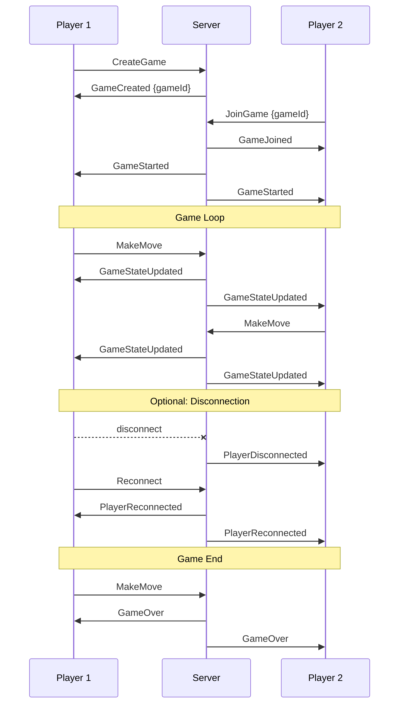

# WebSocket API Version 2

## Overview

The game uses Socket.IO for real-time communication with WebSocket transport. This document describes the events, payloads, and protocols used in the game.

## Connection Setup

```typescript
const socket = io('ws://server-url', {
  transports: ['websocket'],
  autoConnect: true,
  reconnection: true,
  reconnectionDelay: 1000,
  reconnectionDelayMax: 5000,
});
```

## Events

### Client -> Server Events

1. Create Game
```typescript
socket.emit(WebSocketEvents.CreateGame);

// Response
interface GameCreatedPayload {
    gameId: string;    // Unique game identifier
    eventId: string;   // Event identifier for tracking
}
```

2. Join Game
```typescript
socket.emit(WebSocketEvents.JoinGame, {
    gameId: string;    // Game identifier
});

// Response
interface GameJoinedPayload {
    gameId: string;    // Game identifier
    eventId: string;   // Event identifier
    phase: GamePhase;  // Current game phase
}
```

3. Make Move
```typescript
socket.emit(WebSocketEvents.MakeMove, {
    gameId: string;
    move: {
        type: 'place' | 'replace';
        position: { x: number; y: number };
    };
});

// Response
interface GameStateUpdatedPayload {
    gameState: IGameState;
    currentPlayer: number;
    phase: GamePhase;
}
```

4. End Turn
```typescript
socket.emit(WebSocketEvents.EndTurn, {
    gameId: string;
});
```

5. Reconnect
```typescript
socket.emit(WebSocketEvents.Reconnect, {
    gameId: string;
});
```

### Server -> Client Events

1. Game Started
```typescript
interface GameStartedPayload {
    gameState: IGameState;
    currentPlayer: number;
    eventId: string;
    phase: GamePhase;
}
```

2. Game State Updated
```typescript
interface GameStateUpdatedPayload {
    gameState: IGameState;
    currentPlayer: number;
    phase: GamePhase;
}
```

3. Game Over
```typescript
interface GameOverPayload {
    gameState: IGameState;
    winner: number | null;
}
```

4. Player Disconnected
```typescript
interface PlayerDisconnectedPayload {
    player: number;
}
```

5. Player Reconnected
```typescript
interface PlayerReconnectedPayload {
    player: number;
    gameState: IGameState;
    currentPlayer: Player;
}
```

6. Game Expired
```typescript
interface GameExpiredPayload {
    gameId: string;
    reason?: string;
}
```

7. Error
```typescript
interface ErrorPayload {
    code: WebSocketErrorCode;
    message: string;
    details?: unknown;
}
```

8. Available Replaces
```typescript
interface AvailableReplacesPayload {
    replacements: Array<[number, number]>;
    moves: GameMove[];
}
```

## Game Flow



## Game Phases

```typescript
enum GamePhase {
    INITIAL = 'INITIAL',
    CONNECTING = 'CONNECTING',
    WAITING = 'WAITING',
    PLAYING = 'PLAYING',
    GAME_OVER = 'GAME_OVER',
    FINISHED = 'FINISHED',
    ERROR = 'ERROR'
}
```

## Error Codes

```typescript
enum WebSocketErrorCode {
    // Client errors (4xxx)
    InvalidGameCode = 4000,
    GameNotFound = 4001,
    GameFull = 4002,
    InvalidMove = 4003,
    NotYourTurn = 4004,
    InvalidOperation = 4005,
    InvalidState = 4006,
    PlayerNotFound = 4007,

    // Server errors (5xxx)
    InternalError = 5000,
    DatabaseError = 5001,
    ValidationError = 5002,
    StateError = 5003,
    NetworkError = 5004,
    
    // Generic errors
    Unknown = 9999
}
```

## Implementation Notes

### Timeouts and Limits
- Connection timeout: 10 seconds
- Ping interval: 5 seconds
- Ping timeout: 10 seconds
- Upgrade timeout: 10 seconds
- Max buffer size: 1MB
- Player reconnection window: 5 minutes
- Game session expiration: 30 minutes of inactivity

### Connection States
1. Initial Connection
   - Client establishes WebSocket connection
   - Server acknowledges connection
   - Client can create or join game

2. Active Game
   - Both players connected
   - Game state synchronized
   - Turn-based gameplay

3. Disconnection
   - Client loses connection
   - Server marks player as disconnected
   - 5-minute reconnection window
   - Game state preserved

4. Reconnection
   - Client reconnects with gameId
   - Server validates session
   - Game state restored
   - Play continues

### Best Practices

1. Error Handling
   ```typescript
   socket.on(WebSocketEvents.Error, (error: ErrorPayload) => {
       switch (error.code) {
           case WebSocketErrorCode.InvalidMove:
               // Handle invalid move
               break;
           case WebSocketErrorCode.NotYourTurn:
               // Handle turn error
               break;
           // ... handle other errors
       }
   });
   ```

2. State Validation
   ```typescript
   // Before making a move
   if (gameState.currentPlayer !== myPlayerNumber) {
       return; // Not your turn
   }
   if (gameState.gameOver) {
       return; // Game is over
   }
   ```

3. Reconnection Logic
   ```typescript
   // Store game info for reconnection
   localStorage.setItem('gameData', JSON.stringify({
       gameId,
       playerNumber
   }));

   socket.on('connect', () => {
       const gameData = localStorage.getItem('gameData');
       if (gameData) {
           const { gameId } = JSON.parse(gameData);
           socket.emit(WebSocketEvents.Reconnect, { gameId });
       }
   });
   ```

Last updated: January 14, 2025