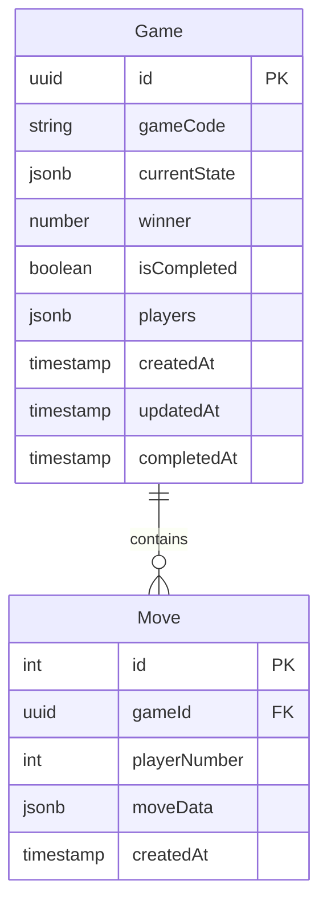

# Database Documentation

## Entity Relationship Diagram



## Entities

### Game
Represents a single game session.

| Field | Type | Description |
|-------|------|-------------|
| id | UUID | Primary key |
| gameCode | String | Unique code for game access |
| currentState | JSONB | Current game board state |
| winner | Integer | Winner's player number (null if draw) |
| isCompleted | Boolean | Whether game is finished |
| players | JSONB | Array of player information |
| createdAt | Timestamp | Game creation time |
| updatedAt | Timestamp | Last update time |
| completedAt | Timestamp | When game was completed |

### Move
Represents a single move in a game.

| Field | Type | Description |
|-------|------|-------------|
| id | Integer | Primary key |
| gameId | UUID | Reference to game |
| playerNumber | Integer | Player who made the move |
| moveData | JSONB | Move coordinates and details |
| createdAt | Timestamp | When move was made |

## TypeORM Configuration

```typescript
{
    type: 'postgres',
    url: process.env.DATABASE_URL,
    synchronize: process.env.NODE_ENV === 'development',
    logging: process.env.NODE_ENV === 'development',
    entities: [Game, Move],
    migrations: ['src/migrations/*.ts'],
}
```

## Database Service Layer

The GameService class handles all database operations related to game management:

1. Game Creation:
   - Creates new game record
   - Initializes empty game state
   - Stores first player information

2. Game Joining:
   - Validates game existence
   - Checks player limit
   - Adds second player

3. Move Processing:
   - Records move in moves table
   - Updates game state
   - Checks win conditions
   - Updates game completion status

4. History and Replay:
   - Stores complete move history
   - Enables game replay functionality
   - Tracks game timeline