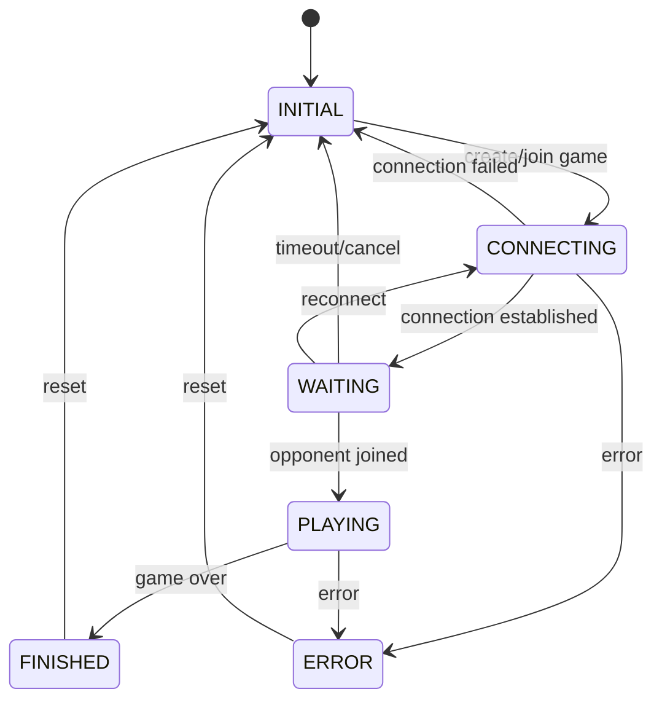

# Game State Machine Documentation

## Overview

This document describes the state machine that governs the game flow and state transitions in CTORGame. The state machine ensures consistent game behavior across the client and server components.

## Game Phases

The game can be in one of the following phases:

- `INITIAL`: Initial state before game creation or after reset
- `CONNECTING`: Attempting to establish connection or join a game
- `WAITING`: Connected and waiting for opponent
- `PLAYING`: Active gameplay
- `FINISHED`: Game completed
- `ERROR`: Error state (recoverable or terminal)

## State Transitions

## Phase Details

### INITIAL
- Default state when application starts
- No active game or connection
- Can transition to CONNECTING when starting or joining a game

### CONNECTING
- Attempting to establish WebSocket connection
- Validating game ID when joining
- Can transition to:
  - WAITING: When connection successful
  - INITIAL: On connection failure
  - ERROR: On validation/server errors

### WAITING
- Connected to server
- Waiting for opponent to join
- Game room created
- Can transition to:
  - PLAYING: When opponent joins
  - INITIAL: On timeout or manual cancel
  - CONNECTING: On connection loss and reconnect attempt

### PLAYING
- Active gameplay
- Both players connected
- Turn-based moves
- Can transition to:
  - FINISHED: When game ends (win/draw)
  - ERROR: On critical gameplay errors

### FINISHED
- Game completed
- Final score displayed
- Can transition to:
  - INITIAL: When starting new game

### ERROR
- Error state for handling issues
- Shows error message to user
- Can transition to:
  - INITIAL: After error acknowledgment or reset

## State Validation

The state machine implementation includes strict validation:

1. State updates must follow allowed transitions
2. Each state must include required properties
3. Invalid state transitions trigger error recovery
4. State consistency checked between client and server

## Implementation Notes

The state machine is implemented in multiple components:

### Client Side
- `GameStateManager.ts`: Manages state transitions and validation
- `validateStateTransition()`: Ensures valid state changes
- `validateStateUpdate()`: Validates state update contents

### Server Side
- `GameServer.ts`: Manages game state and broadcasts updates
- State transitions triggered by WebSocket events
- Redis for persistent state storage

## WebSocket Events and State Changes

| Event | From State | To State | Payload |
|-------|------------|----------|---------|
| CreateGame | INITIAL | CONNECTING | { gameId: string, eventId: string } |
| GameJoined | CONNECTING | WAITING | { gameId: string, eventId: string, phase: GamePhase } |
| GameStarted | WAITING | PLAYING | { gameState: IGameState, currentPlayer: number, eventId: string, phase: GamePhase } |
| GameStateUpdated | PLAYING | PLAYING | { gameState: IGameState, currentPlayer: number, phase: GamePhase } |
| GameOver | PLAYING | FINISHED | { gameState: IGameState, winner: number &#124; null } |

## Error Recovery

The state machine includes built-in error recovery mechanisms:

1. Connection errors:
   - Automatic reconnection attempts
   - State restoration from Redis
   - Session recovery

2. Invalid transitions:
   - Fallback to last valid state
   - Error logging and reporting
   - User notification

3. Validation errors:
   - State recovery attempts
   - Graceful degradation
   - Error boundary handling