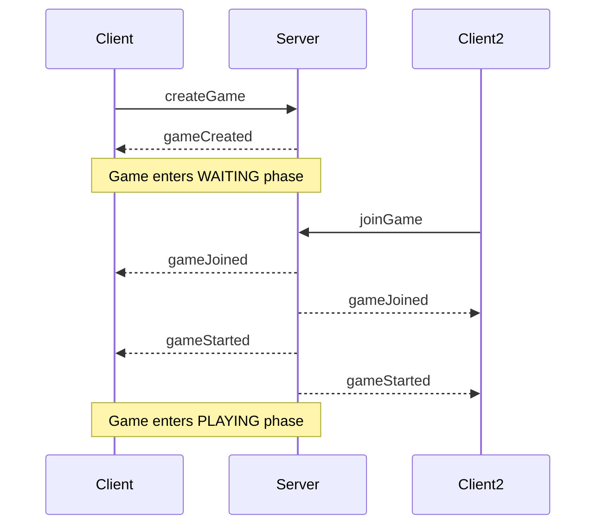
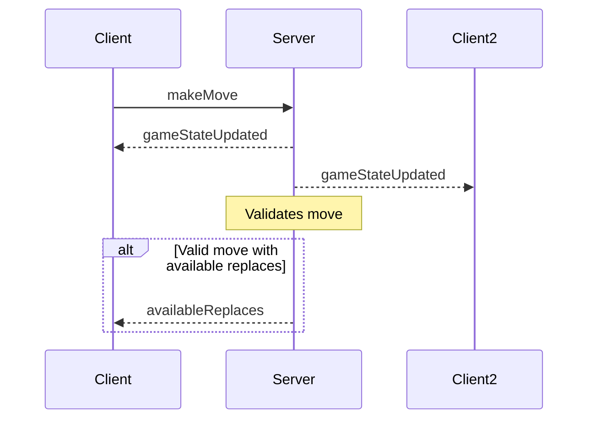

# WebSocket Events Documentation

## Overview

This document details the WebSocket events used for real-time communication between the client and server in CTORGame.

## Event Types

### Client to Server Events

#### `createGame`
- **Purpose**: Request creation of a new game room
- **Payload**: None
- **Response**: GameCreated event

#### `joinGame`
- **Purpose**: Request to join an existing game
- **Payload**:
```typescript
{
    gameId: string;
}
```
- **Response**: GameJoined event

#### `makeMove`
- **Purpose**: Submit a game move
- **Payload**:
```typescript
{
    gameId: string;
    move: IGameMove;
}
```
- **Response**: GameStateUpdated event

#### `endTurn`
- **Purpose**: End current player's turn
- **Payload**:
```typescript
{
    gameId: string;
}
```
- **Response**: GameStateUpdated event

### Server to Client Events

#### `gameCreated`
- **Purpose**: Confirms new game creation
- **Payload**:
```typescript
{
    gameId: string;
    eventId: string;
}
```

#### `gameJoined`
- **Purpose**: Confirms successful game join
- **Payload**:
```typescript
{
    gameId: string;
    eventId: string;
    phase: GamePhase;
}
```

#### `gameStarted`
- **Purpose**: Notifies that game is starting
- **Payload**:
```typescript
{
    gameState: IGameState;
    currentPlayer: number;
    eventId: string;
    phase: GamePhase;
}
```

#### `gameStateUpdated`
- **Purpose**: Updates game state after moves
- **Payload**:
```typescript
{
    gameState: IGameState;
    currentPlayer: number;
    phase: GamePhase;
}
```

#### `availableReplaces`
- **Purpose**: Provides available replacement moves
- **Payload**:
```typescript
{
    moves: IGameMove[];
}
```

#### `gameOver`
- **Purpose**: Notifies game completion
- **Payload**:
```typescript
{
    gameState: IGameState;
    winner: number | null;
}
```

#### `error`
- **Purpose**: Reports error conditions
- **Payload**:
```typescript
{
    code: WebSocketErrorCode;
    message: string;
    details?: Record<string, any>;
}
```

## Event Flow Examples

### Creating a New Game


### Making a Move


## Error Handling

### Error Codes
```typescript
enum WebSocketErrorCode {
    INVALID_GAME_ID = 'INVALID_GAME_ID',
    GAME_NOT_FOUND = 'GAME_NOT_FOUND',
    GAME_FULL = 'GAME_FULL',
    INVALID_MOVE = 'INVALID_MOVE',
    NOT_YOUR_TURN = 'NOT_YOUR_TURN',
    GAME_ENDED = 'GAME_ENDED',
    INVALID_STATE = 'INVALID_STATE',
    CONNECTION_ERROR = 'CONNECTION_ERROR',
    SERVER_ERROR = 'SERVER_ERROR',
    TIMEOUT = 'TIMEOUT'
}
```

### Recovery Strategies

1. **Connection Loss**
   - Client attempts automatic reconnection
   - Server maintains game state
   - Session can be recovered using gameId

2. **Invalid Game State**
   - Server sends error event
   - Client attempts state recovery
   - Falls back to last valid state

3. **Timeout**
   - Server enforces move time limits
   - Clients handle timeout notifications
   - Game state updated accordingly

## Implementation Details

### Client Side
- Socket.IO client instance
- Event handling in GameStateManager
- Automatic reconnection logic
- State validation and recovery

### Server Side
- Socket.IO server instance
- Redis for state persistence
- Event broadcasting to room members
- Move validation and game logic